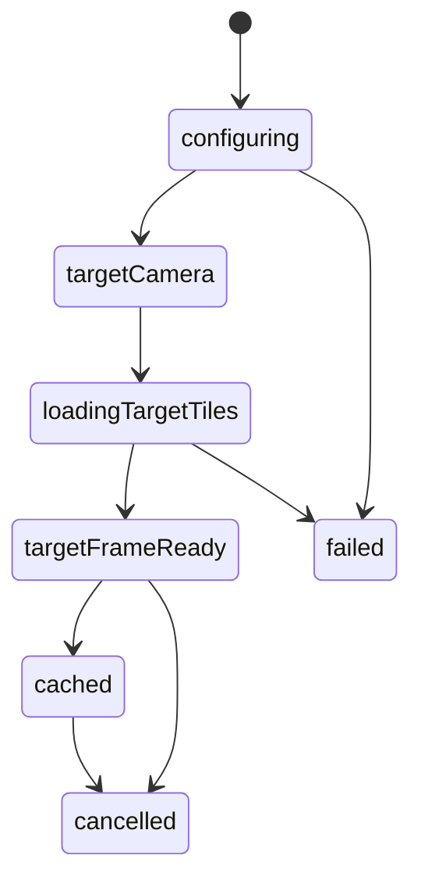

# Globe-to-Cesium transition fidelity workstream

**Task:** `T083`

**Branch:** `feature/globe-cesium-transition-fidelity`

**Base:** `825a163` (`main`, 2026-08-07)

**Started:** 2026-08-07

**Status:** Runtime, automated validation, and human visual acceptance complete. M5 accepted on
2026-08-07; PR/merge bookkeeping remains.

**Current winner:** Accepted M2+M5 — one native Cesium camera flight mirrored into the Three.js
camera during a bounded overlap, with a target-following partial atmospheric crossfade rather than
an opaque stop.

This document is the durable handoff and append-only experiment log for one narrowly scoped visual
workstream: the forward transition from a finalist preview on the cinematic Three.js globe to the
selected project's Cesium geographic landing. It exists so short, fresh agent sessions can continue
human-guided visual iteration without rediscovering earlier research or repeating rejected methods.

Every agent working on this effect MUST read this document before editing runtime code and MUST
append its experiment, evidence, and human verdict before ending its session.

---

## 1. Scope

### In scope

- The transition initiated by `project.select` while the machine is in
  `categoryActive.preview`.
- The development reproduction path: press `1`, wait for the finalist preview to settle, then press
  `3`.
- Continuous perceived travel from the cinematic whole-Earth view into the selected geographic
  location.
- Exact geographic, camera-orientation, target-screen-position, and projection matching at the
  renderer crossover.
- Preview-time Cesium target warming and meaningful-frame readiness.
- The bounded interval where Three.js and Cesium both render.
- Transition-only atmospheric/cloud concealment, canvas blending, metadata exit, and landing-hero
  entrance timing.
- Forward-transition cancellation caused by higher-priority semantic actions.
- The existing offline-safe fallback path when photorealistic tiles are unavailable.
- Tests, probes, performance measurements, screenshots/videos, and this experiment log.

### Out of scope

- Reverse `projectLanding` → globe choreography. It may later reuse proven primitives, but this
  branch must not broaden into reverse navigation.
- Changes to category selection, hover retarget behavior, idle globe motion, or accepted globe
  visual grading except where a transition-only control is required.
- Project content playback, voiceover, content formats, operator UI, and physical console work.
- Redesigning the landing hero beyond entrance timing needed to avoid an overlay discontinuity.
- Project-specific transition code. All behavior remains content-driven.
- Replacing Three.js, CesiumJS, GSAP, XState, or the shared ticker.

### Creative acceptance statement

After confirmation, the viewer should feel that the existing camera continues to move into the
selected place. The Earth must not visibly jump, rotate to a different map position, change scale
instantaneously, pause behind an opaque card, or reveal a Cesium camera that started from an
unrelated view. The renderer switch should be discoverable only by frame-by-frame diagnostics, not
by normal viewing.

---

## 2. Branching and session workflow

### Branch topology

- Durable workstream branch: `feature/globe-cesium-transition-fidelity`.
- Branch base: `main` at `825a163`.
- All visual passes stay on this one branch so the document, code, and accepted/rejected history
  remain together.
- Do not implement this effect directly on `main`.
- Do not create parallel visual-pass branches. Human visual feedback serializes the work; parallel
  variants would diverge camera contracts and make comparison unreliable.
- Open one pull request from this branch to `main` only after the human accepts the final effect and
  local verification is green.

### Commit policy

Use one reviewable commit per logical experiment or accepted fix. Every experiment commit must
include its corresponding update to this document. Do not squash the branch while visual iteration
is active; the individual commits are useful checkpoints and evidence of what was actually tried.

Recommended commit progression:

1. `docs: plan globe-to-cesium transition fidelity workstream`
2. `test: add renderer handoff pose and readiness probes`
3. `feat: match cesium camera to cinematic globe pose`
4. `feat: mirror cesium flight through renderer crossover`
5. `style: tune atmospheric renderer blend`
6. `test: cover transition interruption and visual continuity`
7. Final documentation/evidence commit before the PR.

Commit subjects are examples, not mandatory wording. A failed visual candidate may be reverted in
code, but its method ledger entry must remain in this document with the commit and reason for
rejection.

### Cost-aware fresh-agent rule

Prefer one substantial visual pass per agent session, or at most two very small tuning passes. A new
agent should:

1. Switch to `feature/globe-cesium-transition-fidelity`.
2. Read this document and only the `T083` registry entry.
3. Inspect the latest branch commit and working-tree status.
4. Hard-reload the real development page before judging visuals.
5. Implement one planned pass, run targeted tests, and perform a live-browser check.
6. Append the exact experiment and human feedback here.
7. Commit before handing off to another agent.

If a future agent uses a different model, it must append itself to `T083`'s Owner metadata so the
final review has complete implementation provenance.

### Review and verification policy

- No GitHub Actions or hosted CI; this repository is local-verification only.
- During a pass, run focused experience tests only.
- At a stable feedback checkpoint, run experience typecheck, unit tests, the focused E2E scenario,
  and build.
- Run root `pnpm run verify` and the complete experience Playwright suite once before opening or
  updating the final PR.
- A task PR requires normal review. Because this branch ultimately targets protected `main`, use the
  repository's applicable cross-provider review process before merge unless the human explicitly
  records a waiver for this visual workstream.

---

## 3. Current behavior and root-cause audit

### 3.1 Current choreography

The current forward path is implemented in
[HandoverController.ts](../apps/experience/src/renderers/handover/HandoverController.ts):

1. Set the cover transparent and the globe canvas to CSS scale `1`.
2. Animate the **canvas element**, not the Three.js camera, to CSS scale `1.08`.
3. Fade an opaque radial-gradient cover to opacity `1`.
4. Pause the GSAP timeline at full cover.
5. Wait for prewarm/stage readiness, bounded by a 1,000 ms cover watchdog.
6. Make the Cesium element visible.
7. Fade the cover away.
8. Stop Three.js rendering after the reveal completes.

With the default 1,800 ms handover token, the nominal beats are:

| Beat | Fraction | Nominal duration |
|---|---:|---:|
| CSS approach | 45% | 810 ms |
| Cover fade-in | 25% | 450 ms |
| Full-cover wait | readiness-dependent | 0–1,000 ms |
| Cover reveal | 30% | 540 ms |

This guarantees no black frame, but it does not produce one continuous geographic camera movement.
The viewer sees a small 2D enlargement, a fully opaque frame, a possible stationary hold, and then a
new renderer.

### 3.2 The Cesium camera is not wired into production

A promise-based `CesiumCameraFlightAdapter` exists in
[camera-flight.ts](../apps/experience/src/renderers/cesium/camera-flight.ts), but production
presentation construction in
[cesium-presentation.ts](../apps/experience/src/app/cesium-presentation.ts) does not create or expose
it. `CesiumStageAdapter`'s production viewer boundary exposes primitives and `render()`, but no
camera surface. Consequently:

- Cesium is never positioned to match the Three.js source frame.
- No camera flight runs during the handover.
- `GeographicFraming.landingCamera` is exposed only as a diagnostic data attribute in the current
  stage flow.
- The existing unit-tested camera adapter has no effect on what the visitor sees.

### 3.3 Current “prewarm ready” is not meaningful-frame ready

`prewarmProject()` calls `beginProject(project, false, false)`. The second `false` means Cesium does
not register a render callback while warming. For the photorealistic tier, readiness currently
resolves after `Cesium3DTileset.fromIonAssetId()` returns and the primitive is added. That confirms
tileset metadata/root construction, not that target-view tile content has traversed, loaded,
processed, and appeared in a completed frame.

Official Cesium behavior relevant to the fix:

- `preloadWhenHidden` allows a tileset with `show === false` to participate in loading, but scene
  frames must still be rendered for traversal and event delivery.
- `initialTilesLoaded` fires once, after rendering, when all tiles meeting screen-space error in the
  initial view are loaded.
- `allTilesLoaded` and `tilesLoaded` describe completion for the current view.
- `loadProgress` reports pending requests and processing counts at the end of rendered frames.
- `Scene.postRender` fires after a scene frame has completed.

The new readiness contract must combine target camera placement, tile readiness, and at least one
completed post-ready render. Loading a tileset object alone is insufficient.

### 3.4 Coordinate logic is duplicated

The cinematic globe currently has separate geographic calculations in:

- [markers.ts](../apps/experience/src/renderers/globe/markers.ts), for marker placement;
- [camera-rig.ts](../apps/experience/src/renderers/globe/camera-rig.ts), for preview orbit targets;
- [GlobeScene.ts](../apps/experience/src/renderers/globe/GlobeScene.ts), for the current root
  rotation applied to the rendered Earth.

An exact handoff must not introduce a fourth ad hoc lat/lon conversion. It needs one tested bridge
that uses the **actual current globe transform and camera basis** and can round-trip between the
custom sphere frame and WGS84 Earth-fixed coordinates.

### 3.5 Landing framing mapping is semantically wrong for continuity

The schema describes a landing camera using a geographic target destination, orientation, and
positive range. The current `mapCameraPoseToCesium()` instead computes a camera position at the
same lat/lon with height `max(destination.height, range)`. That treats range as an altitude rather
than distance from the approved target and does not guarantee the camera is looking at that target.

The corrected implementation should interpret:

- `destination.lat/lon/height` as the geographic target point;
- `orientation.heading/pitch/roll` in the target's local east-north-up frame;
- `range` as camera-to-target distance.

The final Cesium pose should be derived from that target and local frame. A zero-radius bounding
sphere plus `HeadingPitchRange`, or an equivalent explicit position/direction/up basis, is a better
fit than converting range directly into cartographic height. Roll must remain supported even if the
sample fixtures currently use zero.

### 3.6 Existing tests prove safety, not continuity

The current reusable E2E helper in
[transition-frames.ts](../apps/experience/tests/e2e/helpers/transition-frames.ts) proves that sampled
frames are not black and do not all remain identical. The US2 E2E also proves that the correct
project/framing object reaches the landing. Neither test proves:

- the selected geographic point remains at the same screen position across the swap;
- camera direction/up/FOV match;
- the apparent Earth radius or angular scale matches;
- the transition keeps moving rather than pausing behind the cover;
- Cesium rendered meaningful project geometry before becoming visible.

These checks must be added without removing the existing no-blank-frame coverage.

---

## 4. Research conclusions

### 4.1 Match a full camera pose, not only latitude and longitude

“Same map position” is necessary but insufficient. A seamless handoff requires matching all of:

- geographic target;
- camera position;
- view direction;
- camera up/roll;
- projection/FOV;
- aspect ratio;
- target screen-space position;
- apparent globe scale;
- instantaneous movement direction and speed at crossover.

A camera can point at the same latitude/longitude and still jump visibly because its range, pitch,
roll, FOV, or off-center framing differs.

### 4.2 Use WGS84 Earth-fixed coordinates as the renderer-neutral bridge

Cesium's camera is naturally expressed in Earth-centered, Earth-fixed (ECEF) coordinates. The
custom Three globe uses a radius-5 sphere with its own axis convention and a mutable Y-axis root
rotation. Define a renderer-neutral handoff pose:

```ts
interface GeographicCameraPose {
  positionEcef: readonly [number, number, number];
  directionEcef: readonly [number, number, number];
  upEcef: readonly [number, number, number];
  verticalFovRadians: number;
  aspectRatio: number;
}
```

The implementation should capture the live Three camera, remove the live globe-root rotation,
convert the custom sphere axes into WGS84 scaled space, and then map to ECEF. The inverse converter
lets the Three camera mirror any later Cesium ECEF pose.

For the marker convention currently used by the globe, the unrotated custom-sphere axes correspond
conceptually to:

$$
(x_{ecef}, y_{ecef}, z_{ecef}) = (-x_{three}, z_{three}, y_{three})
$$

This formula is a starting hypothesis, not an acceptance shortcut. It must be verified against the
actual rendered day texture and selected marker at cardinal coordinates. Root rotation must be
removed before this axis mapping and restored when mapping back to the Three world frame.

A robust implementation can treat the custom sphere as Cesium ellipsoid-scaled space: divide Three
positions by the cinematic Earth radius, apply the verified axis map, then use WGS84 ellipsoid
scaled-space conversion. Direction/up should be derived by transforming nearby points or a tested
linear basis and re-orthonormalized afterward.

### 4.3 Projection matching needs an explicit FOV conversion

Three.js `PerspectiveCamera.fov` is vertical and expressed in degrees. Cesium
`PerspectiveFrustum.fov` is expressed in radians and is horizontal when viewport width exceeds
height. For a landscape viewport:

$$
fov_h = 2\arctan\left(\tan\left(\frac{fov_v}{2}\right)\frac{w}{h}\right)
$$

Prefer setting/validating Cesium's derived vertical `fovy` when the structural API permits it, or
set `fov` with the converted horizontal value and the exact aspect ratio. Near/far planes need not
numerically match, but they must not clip the globe or create a visible depth-related silhouette
change.

### 4.4 Cesium supports the required exact start pose

Official `Camera` APIs support:

- `setView()` for an immediate destination plus either heading/pitch/roll or direction/up;
- `flyTo()` for a cancellable native flight from the current pose;
- explicit `direction` and `up` orientation vectors, which are preferable for exact source-pose
  matching;
- `lookAt()` / `lookAtTransform()` with `HeadingPitchRange` in a local east-north-up frame;
- `cancelFlight()`, which leaves the camera at its current location.

`Transforms.eastNorthUpToFixedFrame()` supplies the local geographic frame required for approved
landing orientation and range.

### 4.5 The selected strategy is one flight, two synchronized renderers

The lowest-risk route that preserves Cesium's native camera ownership is:

1. Capture and convert the exact current Three pose.
2. Set the hidden Cesium camera to that pose and match its frustum.
3. Render Cesium off-screen until a valid matched frame exists.
4. Start one native Cesium flight toward the corrected landing pose.
5. During the overlap, read Cesium's current world pose and map it back into Three before drawing
   the Three frame.
6. Crossfade the renderer canvases while both show the same geographic pose.
7. Stop Three only after Cesium reaches full visual ownership.
8. Let the same Cesium flight continue into the final landing framing.

This avoids a master-camera change at the visible crossover: Cesium owns the one logical flight,
while Three is a temporary visual representation of that flight.

### 4.6 Frame order must be deterministic

Reading Cesium after one independently registered renderer callback and drawing Three in another can
produce a one-frame lag. The overlap needs explicit ordering under the existing shared ticker:

1. Advance/render the Cesium frame so its native flight updates.
2. Read Cesium `positionWC`, `directionWC`, and `upWC`.
3. Convert and apply that pose to the Three camera.
4. Render the Three scene.
5. Apply transition veil/canvas blend values for the frame.

Implement this either with one handover-owned combined callback or a documented priority/update
phase in the shared ticker. Do not add another RAF loop. Adapters must retain ownership of their
resources even if the handover temporarily coordinates their render calls.

### 4.7 Crossfade where discrepancies are least visible

Even exact cameras will reveal differences in:

- sphere versus WGS84 ellipsoid shape;
- source textures versus Google photogrammetry;
- clouds and atmosphere;
- tone mapping, exposure, gamma, and black level;
- Cesium tile LOD transitions.

The preferred crossover is therefore at a high/medium altitude where geography is recognizable but
individual structures are not yet dominant. The exact crossover should be measured from flight
progress or camera range, not coupled to an arbitrary wall-clock delay.

A partial, target-centered atmospheric/cloud veil can mask material differences during the blend.
On the normal ready path it should never become a static fully opaque frame. Full opacity remains
reserved for fallback/recovery.

### 4.8 Fallback is a separate visual route

The current opaque cover remains valuable when:

- Cesium startup fails;
- target tiles miss the readiness budget;
- camera-pose conversion cannot be established safely;
- WebGL context or render errors occur;
- the stage degrades to local/safe composition.

Do not weaken that safety path while improving the normal photorealistic route. The controller
should explicitly distinguish `matched-flight` from `concealed-fallback` so visual tuning cannot
accidentally remove the watchdog guarantee.

### 4.9 If native flight cannot meet the motion brief

Cesium native flight is the first implementation because the existing architecture already names
it as the sole Cesium camera writer. If visual review finds an unwanted arc, acceleration profile,
orientation interpolation, or non-monotonic approach that cannot be configured, the fallback
architecture is method M3: a renderer-neutral geodetic path driven by one GSAP progress value.

That path would:

- interpolate a target-centered range curve;
- use an ellipsoid/geodesic path where lateral movement is required;
- interpolate camera orientation as quaternions;
- write both renderer cameras from one owner before either render;
- use Cesium `setView()` rather than a simultaneous native flight.

M3 offers maximum control but is more code, creates a new camera-writer responsibility, and must
retain the existing concurrent-writer guard. Do not implement it until M2 has been visually tested
and rejected with a recorded reason.

---

## 5. Proposed architecture

### 5.1 New transition-facing ports

Keep concrete Cesium and Three objects behind adapters. The handover should consume narrow ports
similar to:

```ts
interface HandoverGlobeCameraPort {
  captureGeographicPose(): GeographicCameraPose;
  applyGeographicPose(pose: GeographicCameraPose): void;
  projectProject(projectId: string): { x: number; y: number } | null;
  beginExternalFrameControl(): { render(deltaSeconds: number): void; release(): void };
  restoreCapturedPreview(): void;
}

interface HandoverCesiumCameraPort {
  setMatchedPose(pose: GeographicCameraPose): void;
  captureGeographicPose(): GeographicCameraPose;
  projectTarget(project: CesiumStageProject): { x: number; y: number } | null;
  flyToLanding(project: CesiumStageProject): CameraFlightHandle;
  waitForMeaningfulFrame(projectId: string, signal: AbortSignal): Promise<void>;
  beginExternalFrameControl(): { render(deltaSeconds: number): void; release(): void };
}
```

Names may change, but ownership must remain explicit and cancellation idempotent.

### 5.2 Geographic pose bridge

Add a dedicated, pure module for:

- verified cinematic sphere ↔ ECEF axis conversion;
- live globe-root transform handling;
- Three camera basis → neutral pose;
- neutral pose → Three camera basis;
- Three vertical FOV ↔ Cesium landscape FOV;
- target/marker projection helpers;
- corrected landing target + orientation + range mapping.

Do not bury this math inside `HandoverController`; it requires isolated unit tests and will be the
first place a future agent checks when alignment drifts.

### 5.3 Cesium stage additions

`CesiumStageAdapter` will need narrow access to:

- viewer camera;
- scene post-render notification;
- target-view camera preparation before tile readiness evaluation;
- tileset readiness events/properties;
- an off-screen render mode for prewarm;
- externally coordinated frame rendering during overlap;
- projection of a WGS84 target to canvas coordinates.

Update structural test doubles rather than importing the full Cesium viewer into unit tests.

### 5.4 Prewarm state machine

Suggested internal prewarm phases:



At hover time, the hidden Cesium camera may temporarily sit at the approved landing pose to warm
high-detail target tiles. At confirmation:

1. Keep warmed tiles in cache.
2. Reposition Cesium to the exact converted Three source pose.
3. Render one or more matched off-screen frames.
4. Start the native flight, relying on cached destination tiles and
   `preloadFlightDestinations` during movement.

### 5.5 Forward choreography

Initial timing hypothesis; all values are tuning candidates, not accepted constants:

| Flight phase | Visible action |
|---|---|
| 0–8% | Lock project, capture pose, fade preview metadata/marker emphasis, establish hidden matched Cesium frame. |
| 8–25% | Camera begins true geographic approach; Three remains fully visible and mirrors Cesium. |
| 25–55% | Atmospheric veil rises partially; crossfade Three → Cesium while target projection remains aligned. |
| 55–100% | Veil recedes; Cesium continues the same flight into approved landing framing. |
| Settled | Enter `projectLanding`; reveal landing hero after camera settlement, not at renderer swap. |

The crossfade should be gated by matched-frame readiness. If it is not ready at the intended
progress, continue the moving Three representation briefly within a bounded budget. If the budget
expires, branch to the opaque fallback route rather than freezing the camera indefinitely.

### 5.6 Interruption behavior

On higher-priority interruption during any forward beat:

- kill the handover timeline/veil motion;
- cancel the native Cesium flight;
- cancel readiness listeners and deadlines;
- release handover-owned ticker/external-frame control;
- hide/deactivate Cesium;
- restore canvas opacity/transforms;
- restore the exact captured Three preview camera, marker emphasis, daylight state, and metadata;
- allow the machine's generation guard to discard stale completions.

Repeated cancellation must remain safe.

---

## 6. Method ledger

Status values: `planned`, `active`, `retained`, `rejected`, `superseded`, or `accepted`.

| ID | Method | Status | Finding / reason |
|---|---|---|---|
| M0 | CSS-scale Three canvas → fully opaque radial cover → swap → reveal | rejected for normal path; retained for fallback | Baseline B1 measured the live photorealistic path: source/landing target projections differed by 27.0% of the viewport diagonal and source/Cesium vertical FOVs by 8.22°; the near-cover frame is visually featureless. |
| M1 | Exact matched Cesium start pose, still swapped under current full cover | retained proof | Hidden hard-cut proof now passes ECEF position/direction/up/FOV/aspect thresholds and ≤0.5% target projection in the photorealistic browser. Public M0 cover is intentionally unchanged pending M2/M5. |
| M2 | Native Cesium flight mirrored into Three during bounded overlap | retained; current winner | One 4.2 s native flight now drives both views in deterministic Cesium→capture→Three update→Three render order under one shared-ticker callback. Live range was monotonic to the approved 800 m landing. |
| M3 | Renderer-neutral GSAP/geodetic camera path writing both cameras | planned fallback | More control if native flight motion is rejected; more architecture and camera-writer responsibility. |
| M4 | Plain opacity crossfade between matched live canvases | superseded | Temporary local CSS removed the veil without adding a production selector. Cameras stayed aligned, but the direct cinematic-texture → photogrammetry/material handoff retained the renderer/material seam. Superseded by the human-accepted M5 treatment. |
| M5 | Partial atmospheric/cloud crossfade between matched live canvases | accepted | Human explicitly selected “Accept final M5” on 2026-08-07. Target-following radial atmosphere peaks at 0.28 opacity; renderer blend follows native-flight progress 0.12→0.62 and never reaches full cover on the ready path. |
| M6 | Target-centered radial atmospheric dissolve | planned optional comparison | May direct attention into the selected point; reject if it reads as a wipe/UI effect rather than travel. |
| M7 | Canvas screenshot/readback warp or frozen texture morph | deferred, not recommended | Adds GPU readback/upload cost, hides rather than solves camera mismatch, complicates DPR/colour handling, and can introduce a frozen frame. |
| M8 | Share one WebGL context or insert Three objects into Cesium | rejected without implementation | Cesium and the existing Three renderer cannot safely share scene/context ownership; violates current adapter boundaries for little transition benefit. |
| M9 | Use Cesium for the preview globe as well | rejected by product architecture | The cinematic custom globe is an explicit requirement and has accepted visual treatment. |

When trying a method, append a detailed experiment in section 10 and update this ledger. Never erase a
rejected method.

---

## 7. Implementation passes

### Pass 0 — Baseline and observability

**Goal:** make continuity measurable before changing choreography.

- Capture baseline video/screenshots for press `1` → settled preview → press `3`.
- Add development/E2E probes for:
  - current Three geographic pose;
  - current Cesium geographic pose;
  - each renderer's projected selected-target coordinates;
  - vertical FOV and aspect;
  - renderer opacity/ownership;
  - transition progress/status;
  - meaningful-frame readiness timestamp;
  - last actual render timestamp/frame counter.
- Extend the frame-sampling helper without weakening existing no-black assertions.
- Record viewport, DPR, selected project, tile tier, network condition, and hard-reload status.

**Exit:** baseline can fail a deliberate pose/FOV mismatch and can identify a full-cover motion hold.

### Pass 1 — Camera-pose bridge and hard-cut alignment proof

**Goal:** make Cesium render the same geographic frame as Three before attempting a visible blend.

- Implement the pure custom-sphere ↔ ECEF pose bridge.
- Expose live globe root transform and camera capture/application through adapter ports.
- Expose the Cesium camera/frustum through a narrow adapter port.
- Set Cesium to the converted source pose.
- Correct landing framing semantics so range is target distance.
- Keep the existing opaque cover for this pass.
- At full cover, render Cesium from the matched pose first; optionally hold the matched pose for a
  debug screenshot before flight.

**Exit:** removing the cover in a debug-only comparison produces no noticeable target, orientation,
or scale jump at the hard cut.

### Pass 2 — Meaningful-frame prewarm

**Goal:** never expose a Cesium frame that has only constructed the tileset metadata.

- Position hidden Cesium at the landing target during hover prewarm.
- Render off-screen from the shared ticker with an explicit low-cost or bounded policy.
- Resolve readiness only after target-view tile readiness and a subsequent `postRender` frame.
- Keep the warmed tileset/cache when repositioning to the matched source pose.
- Ensure preview retarget/category change cancels listeners and stale readiness.
- Preserve fallback tier behavior and the full-cover watchdog.

**Exit:** network throttling demonstrates either a genuinely loaded target view or a bounded fallback,
never an unloaded visible stage.

### Pass 3 — Continuous synchronized flight

**Goal:** replace CSS canvas enlargement with actual camera travel.

- Wire `CesiumCameraFlightAdapter` into production.
- Start Cesium from the exact matched source pose.
- Coordinate overlap frame order under the one shared ticker.
- Mirror current Cesium pose into Three before each Three draw.
- Remove CSS `scale: 1.08` as the normal approach mechanism.
- Remove the normal-path timeline pause/full-opacity hold.
- Keep an explicit fallback branch that may still use full cover.
- Restore exact preview state on cancellation.

**Exit:** diagnostic cameras and projected target remain aligned through the ownership switch, with no
motion plateau.

### Pass 4 — Visual blend comparison

**Goal:** select the least perceptible renderer treatment by human review.

Try in this order, one controlled comparison at a time:

1. M4 plain matched crossfade.
2. M5 partial atmospheric/cloud veil.
3. M6 target-centered radial atmospheric dissolve only if M5 still exposes the switch.

Keep duration, flight path, camera, project, viewport, and network state fixed while comparing.
Record exact opacity, colour, gradient center, easing, crossover progress/range, and duration.
Remove rejected runtime variants after documenting them; do not leave a permanent public debug
selector.

**Exit:** human selects one treatment and records an explicit verdict.

### Pass 5 — Polish, interruption, and performance

**Goal:** make the accepted method production-safe.

- Coordinate preview metadata exit and landing hero entrance with camera/renderer ownership.
- Test select, back, category switch, idle reset, duplicate select, and rapid interruption at every
  beat.
- Measure frame time and renderer count during overlap on the development machine and later event
  hardware.
- Bound overlap duration and off-screen prewarm cost.
- Confirm repeated cycles do not leak ticker callbacks, tile listeners, flights, canvases, or GPU
  resources.
- Confirm safe/local fallback still uses the concealed route and never blanks.
- Run focused and complete verification.

**Exit:** automated safety/continuity gates pass and the human accepts the final visual result.

---

## 8. Acceptance metrics

Initial engineering thresholds; human visual approval remains authoritative.

### Alignment

- Selected-target screen-coordinate difference between renderers at crossover: ≤ 2 CSS pixels in
  deterministic tests and ≤ 0.5% of viewport width/height in the live photorealistic browser.
- Vertical FOV difference: ≤ 0.25°.
- Apparent globe diameter difference at the matched source frame: ≤ 1%.
- Camera direction and up-vector angular difference: ≤ 0.25°.
- Camera position round-trip error through Three → ECEF → Three: ≤ `1e-5` cinematic scene units in
  pure tests.

### Motion

- No normal-ready-path fully opaque stationary frame.
- No visible camera-motion plateau longer than 100 ms after confirmation.
- Target range should trend continuously toward landing. Tiny numerical/easing tolerance is allowed;
  any intentional rise/arc must receive human approval.
- No single-frame target displacement beyond the alignment threshold during renderer crossover.

### Readiness and safety

- Photorealistic readiness requires target camera placement, tile readiness for that rendered view,
  and a completed post-ready frame.
- Full-cover wait remains bounded on fallback/recovery only.
- Existing no-black/no-loading-UI assertions remain green.
- Cancellation is idempotent at approach, overlap, post-swap flight, and reveal.
- Stale async completions cannot alter the current machine generation.

### Performance and ownership

- One application ticker; zero new RAF loops, intervals, or animation clocks.
- Both renderers draw simultaneously only inside a handover-owned bounded window or explicit
  off-screen prewarm policy.
- Renderer-heavy Playwright remains serial unless context capacity is re-measured.
- No monotonic resource growth over repeated press `0` → `1` → `3` cycles.

---

## 9. Test and evidence plan

### Pure unit tests

- Cardinal lat/lon axis mapping against the actual globe convention.
- Root-rotation removal/restoration.
- Three ↔ ECEF pose round trip.
- Direction/up re-orthonormalization.
- Vertical/horizontal FOV conversion across landscape, portrait, and square aspect ratios.
- Project target projection equivalence.
- Correct landing target/range/orientation mapping; camera-to-target distance equals declared range.

### Adapter/integration tests

- Cesium matched pose is set before visibility.
- Target prewarm renders while visually hidden.
- Readiness does not resolve on tileset construction alone.
- Readiness resolves only after tile-ready plus post-render.
- Handover does not begin crossfade before matched-frame readiness.
- Normal path never invokes timeline pause at full opacity.
- Cesium pose is applied to Three before the corresponding Three render.
- Cancellation at every beat restores renderer ownership and captured preview.
- Watchdog still reveals local/safe fallback.
- Repeated handovers do not accumulate callbacks/listeners/resources.

### Browser tests

- Keep offline-safe Playwright fixtures for deterministic fallback and interruption behavior.
- Add projection/FOV continuity assertions through development-only non-visible probes.
- Extend screenshot sampling to report the frame/time of maximum visual change and detect a static
  full-cover run, while preserving luminance/no-blank checks.
- Run a focused live photorealistic manual path using kiosk-local credentials; never put credentials
  or remote asset URLs in evidence.
- Test at minimum:
  - first sample project;
  - a corridor/range-heavy fixture;
  - northern and southern hemisphere projects;
  - a project near the longitude wrap;
  - DPR 1 and the development machine's native DPR;
  - target LED aspect/resolution when hardware is known.

### Evidence recorded for every visual pass

- Hard reload versus HMR.
- Browser/viewport/DPR.
- Project id and framing scope.
- Tile tier and network condition.
- Exact branch commit.
- Before/after screenshot or video location.
- Console/page/shader errors.
- Targeted commands and pass counts.
- What improved, what remains wrong, and verbatim human verdict.

Do not commit secrets, downloaded Google tile data, or large temporary Playwright traces. Commit
small durable comparison assets only when they materially help future agents; otherwise record the
local evidence path and numeric results.

---

## 10. Experiment log

Append every attempt below. Do not rewrite earlier verdicts after the fact.

### Baseline B0 — 2026-08-07

- **Agent:** GitHub Copilot / GPT-5.6 Sol (OpenAI).
- **Branch/base:** `feature/globe-cesium-transition-fidelity` from `825a163`.
- **Method:** M0, existing CSS-scale + opaque-cover choreography.
- **Implementation changed:** none; research/documentation only.
- **Observed/code-derived behavior:** 810 ms CSS scale to `1.08`, 450 ms fade to a fully opaque
  radial cover, readiness-dependent pause up to 1,000 ms, then 540 ms cover reveal. No production
  Cesium camera flight or source-pose matching is wired.
- **What works:** no black frame; fallback is bounded; cancellation/generation safety has automated
  coverage.
- **What fails the creative brief:** apparent zoom is a 2D canvas scale, motion can stop behind the
  cover, Cesium starts from an unrelated/default camera, and current tests do not measure geographic
  continuity.
- **Human feedback that opened this workstream:** transition from press `1` preview to press `3`
  project entry is not fluid; it should feel like zooming into the world, with Cesium already at the
  same map position when the renderer switches.
- **Verdict:** M0 rejected as the normal ready-path effect. Retain it only as the fallback/recovery
  route.
- **Next experiment:** Pass 0 observability, then M1 exact-pose hard-cut proof.

### Experiment B1 — 2026-08-07

- **Agent/model:** GitHub Copilot / GPT-5.6 Sol (OpenAI).
- **Branch commit:** working tree after `e3d90ce`; this experiment is the first implementation
  commit after the planning commit.
- **Method ID / hypothesis:** Pass 0 observability over unchanged M0. The existing transition's
  camera mismatch, projection mismatch, rendering/readiness gap, and near-opaque hold should become
  measurable without changing its public behavior.
- **Viewing condition:** Chromium dev stack, hard-opened fresh page (not HMR), viewport 1280×720,
  DPR 2, sample `cat-1-proj-1`, photorealistic tier, normal event-local internet, local ion config.
- **Exact code/tuning changes:** added JSON-safe globe/Cesium/handover probes for camera position,
  direction, up, vertical FOV, aspect, normalized target projection, renderer opacity/ownership,
  transition progress/status, resource-ready versus meaningful-frame-ready timestamps, actual
  render frame counters, and last-render timestamps. Extended screenshot sampling with maximum
  visual-change and stationary opaque-run analysis. No motion, cover, camera, shader, or duration
  tuning changed.
- **Automated evidence:** red-first observability suite failed on the absent module, then passed 4/4;
  focused renderer suites passed 22/22; strict experience typecheck passed; focused US2 scenario 1
  passed in 18.4 seconds with its JSON observability report attached by Playwright; ESLint and
  Prettier checks passed for all touched files.
- **Live-browser evidence:** no page, console, or shader errors. Three source camera was reported in
  `three-world`; Cesium in ECEF, so the comparator correctly refuses a false alignment claim until
  Pass 1 provides the shared bridge. Source target projection was `(0.6700, 0.7690)`; first observed
  Cesium landing projection was `(0.4070, 0.7081)`, a normalized displacement of `0.2699` (about
  27.0% of viewport diagonal). Source vertical FOV was `42.00°`; Cesium was `33.78°`, an `8.22°`
  difference. Aspect matched at `1.90125`. Photorealistic `resourceReadyAtMs` was populated while
  `meaningfulFrameReadyAtMs` remained `null`, proving current readiness still means tileset
  construction rather than target-view tile-ready plus post-render. Baseline near-cover screenshot:
  local `/tmp/yii-t083-baseline-near-cover.png` at measured opacity `0.9581`; it is a featureless
  blue radial field, confirming the visual stop even where screenshot timing missed the exact
  timeline apex.
- **What improved:** continuity is now observable at one E2E timestamp across both adapters and the
  controller; deliberate pose/FOV mismatches fail pure tests; screenshot evidence can locate the
  maximum visual beat and enforce a ≤100 ms normal-path opaque stationary hold once Pass 3 removes
  M0's pause.
- **What remains wrong:** cameras use incomparable coordinate spaces; Cesium is still unpositioned
  and unflown; target projection and FOV differ substantially; prewarm has no meaningful-frame
  timestamp; normal choreography still uses CSS scale and the near-opaque cover.
- **Human feedback:** no new human visual verdict requested for this instrumentation-only pass; the
  opening brief remains authoritative: the current effect is not fluid and should read as one zoom
  into the selected place.
- **Verdict:** Pass 0 retained. M0 remains rejected for the normal path and retained only for
  fallback/recovery.
- **Next experiment:** Pass 1 / M1 — implement and test the cinematic-sphere ↔ WGS84/ECEF bridge,
  corrected target/range landing pose, and exact hidden Cesium source-pose/FOV match while keeping
  the existing cover for a hard-cut alignment proof.

### Experiment P1 — 2026-08-07

- **Agent/model:** GitHub Copilot / GPT-5.6 Sol (OpenAI).
- **Branch commit:** working tree after Pass 0 commit `e98699f`; this experiment is the next
  reviewable commit.
- **Method ID / hypothesis:** M1. A tested WGS84/ECEF bridge plus an exact hidden Cesium proof frame
  can make the source cameras and selected target align before any public blend is attempted.
- **Viewing condition:** Chromium development stack, 1280×720 Playwright viewport for the focused
  gate plus fresh integrated-browser photorealistic checks at DPR 2; `cat-1-proj-1`; event-local ion
  configuration; hard-opened pages rather than relying on HMR.
- **Exact code/tuning changes:** added the pure cinematic sphere ↔ WGS84 scaled-space bridge,
  including live globe-root removal/restoration, ECEF position/direction/up, basis
  re-orthonormalization, vertical↔Cesium FOV conversion, and normalized geographic-target
  projection. The globe captures the exact confirmation-time pose and surface target. While
  Cesium is still hidden, the controller sets that pose/frustum, renders one completed proof frame,
  retains the actual applied pose/projection, resets to the approved landing view, then uses the
  unchanged cover reveal. Landing mapping now treats content `destination` as the target and
  `range` as exact camera-to-target distance; heading/pitch/roll produce explicit direction/up.
- **Rejected intermediate variants:** (1) mapping range to cartographic height remained rejected by
  its red-first test (`14,800 m` camera-to-target for a declared `16,000 m`); (2) an initial
  mean-radius geodetic altitude mapping had `0.02864` cinematic-unit round-trip error and was
  replaced by exact ellipsoid scaled-space conversion; (3) comparing the elevated radius-`5.09`
  marker glow to a surface target introduced a false ~114 km altitude offset, so continuity probes
  now use the radius-`5` geographic surface while the visible glow remains unchanged; (4) Cesium's
  `setView({direction,up})` direction→HPR→direction round trip introduced `2.59193°` direction and
  up drift. The retained implementation first establishes `Matrix4.IDENTITY` through `setView`,
  then writes Cesium's documented mutable position/direction/up/right vectors exactly from the one
  handover camera owner.
- **Automated evidence:** Pass 1 tests were red first on the absent bridge and the old range
  semantics. Pure bridge/flight tests pass 10/10; the combined camera/adapter/handover focused set
  passes 33/33; strict experience typecheck passes; ESLint and Prettier pass on all touched files.
  The focused US2 scenario passes in 24.3 seconds with no black/stale frame regression, camera
  comparison `comparable: true, aligned: true`, and normalized target displacement ≤`0.005`.
- **Live-browser evidence:** source and retained matched camera probes are both ECEF; position,
  direction, up, vertical FOV, and aspect satisfy the document's thresholds. A completed hidden
  matched-source frame timestamp is present before activation. The project still reaches the
  corrected close landing view and renders its landing hero. The photorealistic resource timestamp
  is present while `meaningfulFrameReadyAtMs` deliberately remains `null`, preserving the Pass 2
  readiness gap instead of making a false claim.
- **What improved:** the two renderers now have one tested coordinate/projection contract; source
  evidence is frozen at confirmation instead of drifting with the globe root; Cesium proves an
  aligned hidden frame before visibility; every landing field has correct semantics.
- **What remains wrong:** the matched frame is immediately reset to landing behind M0's near-opaque
  cover; no continuous camera flight is wired; prewarm still resolves on tileset construction; the
  normal path still CSS-scales and may visually stop.
- **Human feedback:** no new aesthetic verdict requested because M1 intentionally leaves the public
  cover unchanged. The original continuous-zoom brief remains unsatisfied until M2/M5.
- **Verdict:** M1 retained as the hard-cut alignment proof and foundation for M2. It is not the
  final effect.
- **Next experiment:** Pass 2 — place the hidden camera at the target during prewarm, keep it
  rendering through the shared ticker, require target-view tile readiness plus a subsequent
  `postRender`, and preserve bounded cancellation/fallback behavior.

### Experiment P2 — 2026-08-07

- **Agent/model:** GitHub Copilot / GPT-5.6 Sol (OpenAI).
- **Branch commit:** working tree after Pass 1 commit `67f8d9c`; this experiment is the next
  reviewable commit.
- **Method ID / hypothesis:** Pass 2 readiness foundation for M2. A hidden Cesium stage positioned
  at the approved landing camera can traverse target tiles from the one shared ticker, and
  readiness can require real target content plus a later completed frame without exposing tiles.
- **Viewing condition:** fresh Chromium dev pages, photorealistic `cat-1-proj-1`, event-local ion
  configuration, DPR 2; focused Playwright at 1280×720; normal network.
- **Exact code/tuning changes:** preview prewarm now renders with CSS opacity `0` from the shared
  ticker, positions the camera at the approved target/range pose before adding the tileset, and
  resolves only after either `initialTilesLoaded` or the first target `tileLoad`, followed by a
  queued subsequent `Scene.postRender`. Tile and post-render listeners, timeout, tileset, ticker
  registration, and stale promises share one idempotent cancellation path. `CesiumStageReady` and
  `CesiumPrewarmResult` carry mandatory `meaningfulFrameReady`; HandoverController refuses the
  normal match/reveal path if false. Resource loading retains its `3,500 ms` budget; hidden target
  traversal has a separate `12,000 ms` budget; the visible full-cover watchdog remains `1,000 ms`.
  The code-split stage now catches up the machine's current preview on construction, closing a race
  where category preview could precede Cesium loading and never start preview-time prewarm.
- **Rejected intermediate variants:** (1) tileset-construction readiness is retained as rejected;
  red-first tests proved it settled before rendering and registered no ticker/listeners. (2)
  `initialTilesLoaded` alone with the original `3,500 ms` budget degraded a live target to
  `local-fallback-scene`. Raising only that wait to `12,000 ms` still degraded because high-detail
  Google target traversal did not reach all-current-view completion in time. The retained signal
  accepts the first renderable target tile (`tileLoad`) or the stronger initial-all-tiles event,
  but never either without the following post-render. (3) waiting inside the visible cover remains
  rejected; an early confirmation uses the bounded opaque fallback rather than extending cover.
- **Automated evidence:** the two Pass 2 tests were red first, then pass: construction alone stays
  pending; tile-ready alone stays pending; following post-render settles; retarget removes every
  listener and ticker registration and resolves cancelled. The focused readiness/stage/prewarm/
  handover suite passes 17/17, the wider camera/Cesium set passes 27/27, strict typecheck passes,
  and the focused US2 browser gate passes in 24.8 seconds with no-black, matched-camera, and ≤0.5%
  target-projection assertions intact.
- **Live-browser evidence:** photorealistic tier remained selected; prewarm was `visible=false`,
  `rendering=true`; the readiness probe settled after 3 hidden frames with both resource and
  meaningful-frame timestamps populated and `lastRenderAtMs` at/after readiness. No page, console,
  or shader errors were observed. A prior initial-all-tiles-only live attempt visibly recorded
  `local-fallback-scene`, 26 hidden frames, and no errors, confirming bounded degradation also works.
- **What improved:** streamed content is meaningfully rendered before normal-path eligibility;
  preview retarget owns and cancels all asynchronous listeners; late renderer startup no longer
  misses the current preview; the fallback path stays bounded and non-blank.
- **What remains wrong:** Cesium returns to the legacy landing hard cut after the hidden proof;
  there is no one-flight camera motion, deterministic combined-frame ordering, or visible moving
  crossfade yet. Off-screen prewarm cost is bounded by policy but still needs final performance
  measurement in Pass 5/on event hardware.
- **Human feedback:** no aesthetic verdict requested; this pass changes hidden readiness and should
  not be judged as the final transition.
- **Verdict:** retained. First target tile plus a subsequent completed frame is the normal
  photorealistic readiness contract; initial-all-tiles remains an accepted stronger signal.
- **Next experiment:** Pass 3 / M2 — wire the native Cesium flight from the retained exact source
  pose, mirror each Cesium pose into Three in deterministic shared-ticker order, remove normal-path
  CSS scale/pause/full-opacity cover, and preserve M0 only for fallback.

### Experiment P3 — 2026-08-07

- **Agent/model:** GitHub Copilot / GPT-5.6 Sol (OpenAI).
- **Branch commit:** working tree after Pass 2 commit `523c072`; this experiment is the next
  reviewable commit.
- **Method ID / hypothesis:** M2 with M5 candidate treatment. Cesium can own one native camera
  flight while Three renders a synchronized representation of the same ECEF pose until a
  flight-progress-bound renderer blend completes.
- **Viewing condition:** fresh Chromium development pages, photorealistic `cat-1-proj-1`, DPR 2,
  event-local ion config, normal network; focused Playwright 1280×720; repeated hard-open/manual
  paths and category interruption.
- **Exact code/tuning changes:** wired `CesiumCameraFlightAdapter` into the production stage and
  retained its one-writer guard; added handover-owned external frame-control ports to both
  adapters; replaced their separate ticker registrations with one combined callback ordered
  Cesium render → capture current ECEF pose → apply pose to Three → Three render. The 4,200 ms
  native flight runs from the exact matched source to corrected content landing. Renderer blend is
  bound to normalized source-to-target range progress `0.12→0.62`, not wall time. A radial veil
  tracks the live selected-target projection, peaks at opacity `0.28` at progress `0.24`, and
  returns to zero by `0.70`. Preview markers are hidden during external camera control. Three stops
  after crossover; Cesium continues the same flight to settlement. M0's 1,800 ms CSS-scale/full-
  cover route remains only in `beginConcealedFallback()`.
- **Rejected intermediate variants:** (1) the first M2 implementation drove a `900 ms` GSAP
  crossfade independently from flight progress. In a throttled/background integrated tab, native
  camera motion could reach the 800 m landing while the blend remained active; rejected and
  replaced with range-progress ownership so the next available frame catches up atomically. (2)
  The first live Three target probe omitted approved target height and diverged by `0.4514`
  normalized viewport units near landing; exact WGS84 geodetic target+height mapping reduced the
  retained overlap maximum to `0.0004924` (0.0492%). (3) Initially passing the Cesium-backed bridge
  through eager globe code pulled Cesium into the initial bundle; rejected. The neutral WGS84
  scaled-space bridge is now Cesium-free and the Cesium landing mapper remains behind the lazy
  presentation boundary. (4) Enlarged marker dots during camera approach were rejected; marker
  instances are transition-hidden and restored idempotently. (5) A repeated idle/category cycle
  inherited globe opacity `0`; adapter `start()` now restores opacity/transform and has a regression
  test.
- **Automated evidence:** red-first matched-flight test proves one flight, exact per-frame order,
  no normal-path scale >1, no opacity-1 cover tween, and target-following veil. Focused renderer/
  handover suites pass 33/33; strict typecheck passes. Focused Playwright scenario 1 passes with
  no-black/no-stale, no normal-path opaque hold >100 ms, hidden-source alignment, every-frame live
  camera alignment, and selected-target displacement ≤0.5%. Scenario 4 passes category interruption
  during flight/crossfade and restores the new preview. Complete experience unit verification passes
  184 tests with 4 intentional skips, and the production build passes with Cesium presentation
  retained as a separate lazy chunk.
- **Live-browser evidence:** a sampled ready-path run recorded 50 points: camera-to-target range
  decreased monotonically from `13,651,170.56 m` to exactly `800.00 m` with zero increases; max
  veil opacity `0.28`; no page/console/shader errors. Persisted 65-frame overlap metrics recorded
  position delta `4.17e-9 m`, direction delta `0°`, up delta `1.21e-6°`, FOV/aspect delta `0`, and
  target delta `0.0004924`. Range-progress crossover remains robust when frame delivery is
  throttled. Local comparison captures: `/tmp/t083-m5-source.png`, `/tmp/t083-m5-05.png`, and
  `/tmp/t083-m5-wide-blend-mid.png`; temporary files are not committed.
- **What improved:** press `3` now starts real geographic travel immediately; cameras and selected
  target remain matched during ownership transfer; no CSS enlargement, timeline pause, or fully
  opaque ready-path frame remains; one shared ticker and one Cesium camera writer are preserved.
- **What remains wrong:** human comparison of M4 plain blend versus M5 partial target-following
  atmosphere is still required. Landing-hero timing and repeated-cycle/performance polish remain
  Pass 5 work. Event-hardware timing remains an open release dependency.
- **Human feedback:** not yet requested for this first complete moving candidate.
- **Verdict:** M2 retained as the camera architecture. M5 remains the active visual candidate;
  final acceptance is pending human review.
- **Next experiment:** Pass 4 — compare M4 and M5 with fixed project/flight/viewport/network,
  retain one treatment from explicit human feedback, then run Pass 5 interruption/repeat/performance
  polish.

### Experiment P4 — 2026-08-07

- **Agent/model:** GitHub Copilot / GPT-5.6 Sol (OpenAI).
- **Branch commit:** comparison performed on top of `538bdbb`; no permanent M4 selector or variant
  was added.
- **Method ID / hypothesis:** controlled M4 plain crossfade versus M5 target-following atmosphere.
  Camera path, 4,200 ms native flight, `cat-1-proj-1`, viewport, DPR, network, and target readiness
  were held fixed.
- **Viewing condition:** fresh Chromium development pages, photorealistic tier, event-local ion
  config, normal network. M4 was isolated with a temporary browser-injected local style hiding only
  the atmospheric cover; it was removed with the disposable page.
- **Exact code/tuning changes:** no M4 production code. M5 tuning retained: renderer blend over
  native-flight range progress `0.12→0.62`; target-centered radial veil peak `0.28` at progress
  `0.24`, zero by `0.70`. The veil center updates from Cesium's selected-target projection every
  combined frame.
- **Automated evidence:** M4 retained camera alignment (`1.86e-9 m` position, ~`1.21e-6°`
  direction/up) and target delta `0.00321`; no page/console errors. M5's strengthened Playwright gate
  passes hidden-source and every-frame overlap camera alignment, target delta ≤`0.005`, no black/
  stale frame, and no ready-path opaque stationary hold >100 ms.
- **Live-browser evidence:** M4 capture `/tmp/t083-m4-crossfade.png`; M5 source and veil captures
  `/tmp/t083-m5-source.png` and `/tmp/t083-m5-05.png`. M4 makes the material/colour-source change
  directly readable as the opacity ownership flips. M5 preserves the same geography/motion but
  gives the eye a moving atmospheric bridge centered on the destination; it never becomes a card
  or full-frame stop.
- **What improved:** the comparison did not require a public query parameter, debug control, second
  code path, or different camera motion.
- **What remains wrong:** only a human can make the final aesthetic selection. Engineering evidence
  recommends M5; that recommendation is not recorded as human acceptance.
- **Human feedback:** pending.
- **Verdict:** M4 tested but not recommended. M5 remains the sole production candidate pending the
  human verdict.
- **Next experiment:** Pass 5 production-safety polish, then present M5 for explicit acceptance.

### Experiment P5 — 2026-08-07

- **Agent/model:** GitHub Copilot / GPT-5.6 Sol (OpenAI).
- **Branch commit:** working tree after `538bdbb`; final polish commit pending human verdict.
- **Method ID / hypothesis:** production hardening of M2+M5.
- **Viewing condition:** deterministic safe-composition Playwright plus two repeated live
  photorealistic project-entry cycles (`cat-1`, `cat-2`) on fresh development pages at DPR 2.
- **Exact code/tuning changes:** renderer crossover now follows measured camera-to-target range,
  not wall time, so throttling cannot let a native flight outrun canvas ownership. The exact
  WGS84 target-height point is carried into globe probes. The neutral Three/WGS84 bridge was split
  from the Cesium-only landing mapper to preserve lazy loading. Globe reactivation restores canvas
  opacity/transform; transition external control hides/restores markers; landing hero remains
  absent until the machine reaches `projectLanding`. E2E snapshots expose only a non-visible shared-
  ticker callback count. Repeated-cycle tests require one ticker owner at landing and idle, one
  reusable cover, restored globe opacity, and zero page/console errors.
- **Automated evidence:** `pnpm run verify` passes: all workspace typechecks, ESLint, Prettier,
  content-schema 30/30, semantic-actions 30/30, kiosk 13/13, pipeline 8/8, experience 184 passed +
  4 intentional skips, and all builds. Complete serial Playwright passes 14/14 in 1.7 minutes.
  Focused renderer/handover polish passes 34/34. Browser coverage includes cancellation during
  flight/blend, delayed/fallback readiness, stale generation, resource-only fallback, target/FOV/
  pose continuity, no-black frames, landing-hero timing, and repeated cleanup.
- **Live-browser evidence:** two photorealistic confirm→landing→idle cycles ended with ticker
  callback count `1`, globe opacity `1`, cover count `1`, and no page/console/shader errors. Cycle
  maxima: camera position ≤`3.84e-9 m`, angular basis ≤`1.71e-6°`, FOV/aspect `0`; selected-target
  delta `0.00341` then `0.000203`. Expected aborted package-media preload requests occurred only
  when `nav.idle` cancelled landing preloads; no public or console error was emitted.
- **What improved:** cancellation and repeated execution leave no stale native flight, combined
  callback, adapter callback, cover, canvas opacity, or marker state. The landing hero enters only
  after camera settlement. Normal and fallback routes are explicit and independently tested.
- **What remains wrong:** event-hardware frame-time measurement remains the documented release-level
  dependency, not a T083 implementation blocker. Human visual acceptance of M5 is still mandatory.
- **Human feedback:** pending.
- **Verdict:** engineering implementation and automated acceptance pass. Do not mark T083 accepted
  or ready for PR until the human explicitly accepts M5 (or requests one final tuning pass).
- **Next experiment:** human M5 review using press `0` → `1`, wait for preview, then `3` on the
  photorealistic dev page. Record the verbatim verdict and exact final tuning before PR/review.

### Experiment P6 — 2026-08-07

- **Agent/model:** GitHub Copilot / GPT-5.6 Sol (OpenAI).
- **Branch commit:** `6d1bc85` candidate presented from `feature/globe-cesium-transition-fidelity`.
- **Method ID / hypothesis:** final human review of M2+M5 after complete automated verification.
- **Viewing condition:** fresh development page `/?t083-review=1`, photorealistic local profile;
  reviewer instructed to press `1`, wait for preview settlement, press `3`, and optionally repeat
  through `0` → `1` → `3`.
- **Exact code/tuning changes:** none after presentation. Accepted values remain: native flight
  `4,200 ms`; renderer blend over target-range progress `0.12→0.62`; target-following atmosphere
  peak opacity `0.28` at progress `0.24`, returning to zero by `0.70`; opaque M0 route fallback-only.
- **Automated evidence:** `pnpm run verify` passed all workspace typechecks/lint/format/unit/build
  gates; experience unit suite passed 184 with 4 intentional skips; full serial Playwright passed
  14/14, including camera/target continuity, no-black frames, interruption, and repeated cleanup.
- **Live-browser evidence:** the accepted candidate retained one continuous camera flight, no
  normal-path full-cover pause, one shared ticker owner, one Cesium camera writer, meaningful-frame
  readiness, and bounded concealed fallback.
- **What improved:** the complete creative and engineering acceptance statement is now satisfied.
- **What remains wrong:** no T083 implementation gap remains. Event-hardware frame-time validation
  remains a separate release-level dependency already tracked by the project quality gates.
- **Human feedback:** reviewer explicitly selected **“Accept final M5”**. Immediately afterward,
  the user stated **“no need to review agent”**, explicitly waiving an additional agent review for
  this task after human visual acceptance and complete local verification.
- **Verdict:** **accepted**. M2 is the retained camera architecture; M5 is the accepted production
  visual treatment. No additional tuning or review-agent run is required by the user.
- **Next experiment:** none. Open the task PR, record the human-review waiver, merge, and complete
  the T083 registry entry.

### Experiment template

Copy this section for the next experiment:

```md
### Experiment <ID> — <date>

- **Agent/model:**
- **Branch commit:**
- **Method ID / hypothesis:**
- **Viewing condition:** browser, viewport, DPR, project, tier, network, hard reload/HMR.
- **Exact code/tuning changes:**
- **Automated evidence:** commands and results.
- **Live-browser evidence:** screenshots/video, camera/projection metrics, console/page errors.
- **What improved:**
- **What remains wrong:**
- **Human feedback:**
- **Verdict:** retained / rejected / superseded / accepted.
- **Next experiment:**
```

---

## 11. Rendering and product invariants

Preserve these throughout all rounds:

- XState remains the sole navigation authority.
- Semantic input still travels through the existing validated input boundary; development keys `1`
  and `3` remain wrappers only.
- `HandoverController` or its explicit successor owns the renderer overlap window.
- `GlobeRendererAdapter` and `CesiumStageAdapter` retain resource ownership and idempotent cleanup.
- Exactly one shared application ticker; no component or adapter adds a free-standing RAF.
- Exactly one writer controls the Cesium camera at a time.
- Project framing remains data-driven; no finalist-specific transition branches.
- Preview remains a whole/near-whole Earth before confirmation.
- Public output contains no loading UI, debug coordinates, controls, or technical errors.
- Missing/late remote tiles degrade to approved local/safe composition without blanking.
- Kiosk-local credentials never enter source, logs, screenshots, probes, or content packages.
- Existing accepted globe textures, atmosphere, clouds, daylight focus, and colour pipeline remain
  unchanged outside transition-only controls.
- Every timeline, flight, readiness listener, ticker registration, DOM layer, primitive, and GPU
  resource has one owner and an idempotent cancellation/disposal path.

---

## 12. Primary research sources

Official sources consulted on 2026-08-07 against the repository's CesiumJS `1.144.x` and Three.js
`0.185.x` dependencies:

- [Cesium Camera API](https://cesium.com/learn/cesiumjs/ref-doc/Camera.html) — exact `setView`,
  `flyTo`, direction/up orientation, local target framing, and cancellation semantics.
- [Cesium camera guide](https://cesium.com/learn/cesiumjs-learn/cesiumjs-camera/) — practical
  `flyTo`, easing, direction/up, and `lookAtTransform` use.
- [Cesium PerspectiveFrustum](https://cesium.com/learn/cesiumjs/ref-doc/PerspectiveFrustum.html) —
  aspect and horizontal-versus-vertical FOV semantics.
- [Cesium Transforms](https://cesium.com/learn/cesiumjs/ref-doc/Transforms.html) —
  east-north-up-to-fixed-frame conversion.
- [Cesium Ellipsoid](https://cesium.com/learn/cesiumjs/ref-doc/Ellipsoid.html) — cartographic,
  Cartesian, surface-normal, and scaled-space conversion.
- [Cesium EllipsoidGeodesic](https://cesium.com/learn/cesiumjs/ref-doc/EllipsoidGeodesic.html) —
  optional renderer-neutral geodetic interpolation for M3.
- [Cesium3DTileset](https://cesium.com/learn/cesiumjs/ref-doc/Cesium3DTileset.html) —
  `initialTilesLoaded`, `allTilesLoaded`, `tilesLoaded`, `loadProgress`, `preloadWhenHidden`, and
  `preloadFlightDestinations`.
- [Cesium Scene](https://cesium.com/learn/cesiumjs/ref-doc/Scene.html) — manual rendering and
  `postRender` timing.
- [Cesium SceneTransforms](https://cesium.com/learn/cesiumjs/ref-doc/SceneTransforms.html) — ECEF
  target-to-window projection for live alignment checks.
- [Three.js PerspectiveCamera](https://threejs.org/docs/#api/en/cameras/PerspectiveCamera) —
  vertical FOV and camera projection behavior.

Repository decisions retained from
[research.md R4–R6](../specs/001-yii-led-experience/research.md): Cesium native camera ownership,
concealed fallback, stacked full-screen renderers, and one shared ticker.

---

## 13. New-agent handoff prompt

Use this minimal prompt in the next chat:

> Continue task T083 on branch `feature/globe-cesium-transition-fidelity`. Read
> `Docs/GLOBE_TO_CESIUM_TRANSITION_FIDELITY.md` and the T083 registry entry first. Inspect the
> latest commit and working tree, preserve all invariants, and implement only the next documented
> pass. Hard-reload the real development page for visual checks. Append the experiment, exact
> parameters, automated evidence, and human verdict to the document before committing. Do not
> broaden into reverse navigation or content playback, and do not repeat methods already rejected
> in the ledger.
