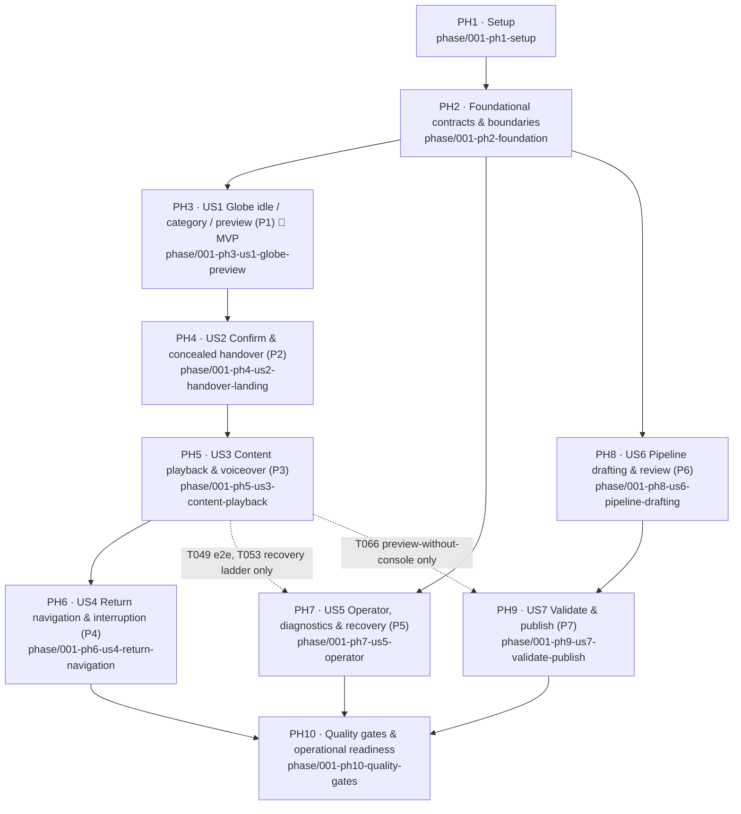

# Tasks: YII 2026 Interactive LED Experience

**Feature**: `F001` (`001-yii-led-experience`) | **Input**: design documents from `specs/001-yii-led-experience/`
**Prerequisites**: [plan.md](./plan.md), [spec.md](./spec.md), [research.md](./research.md), [data-model.md](./data-model.md), [contracts/](./contracts/), [quickstart.md](./quickstart.md), constitution v1.0.0

> **THIS FILE IS THE SINGLE SOURCE OF TRUTH FOR ALL IMPLEMENTATION WORK.**
> Every contributor — human or AI agent — MUST read this registry before starting any work and
> MUST keep it current (claim tasks, update statuses, record branches/PRs/blockers).

---

## 1. Task Registry Protocol

### Status legend (use exactly these)

| Mark | Meaning |
|---|---|
| `[ ]` | Not started |
| `[~]` | Claimed / in progress |
| `[?]` | Blocked (record the blocker in the task's **Blockers** field) |
| `[R]` | Implementation complete — PR open, awaiting review |
| `[x]` | Merged and complete |

### Definition of Done — a task may be marked `[x]` ONLY after ALL of

1. Required tests pass (locally and in CI).
2. The implementation is submitted through a pull request.
3. The pull request receives code review (see §3 Code Review Protocol).
4. Required review changes are resolved.
5. The pull request is merged.

Writing code alone NEVER completes a task.

### Claiming & updating

- **Claim**: pull latest `main`, set the task's status to `[~]`, fill **Owner** (name or
  `agent:<Model Name (Provider)>`) and **Branch**, commit the tasks.md change before starting.
- **Update**: when opening a PR set status `[R]` and record **PR**; when blocked set `[?]` and
  fill **Blockers**; after merge set `[x]`.
- One task = one claim. Do not batch-claim tasks you are not actively working.
- Strict TDD: every verification task (marked *(red-first)*) MUST exist and fail before its
  paired implementation task is coded.

### Branch & PR model

- `main` — protected; only phase branches merge into it, and only after the cross-provider
  review gate (§3).
- **Phase integration branches**: `phase/001-phN-<slug>` (listed in each phase header). Created
  from `main` when the phase starts.
- **Task branches**: `task/001-T0XX-<slug>` (pre-filled per task). PR target = the task's phase
  branch. Task PRs require green CI + one review.
- **Phase PR**: phase branch → `main`. Requires: all phase tasks `[x]` or explicitly deferred,
  full CI green, and an **APPROVE verdict from the code-review agent run on a different model
  provider than the implementation** (§3).

### Task field reference

Each task carries: checklist line (`ID`, `[P]` = parallelizable, `[USn]` = user story, title with
file path) · **Meta** (Phase, Feature, Owner, Branch, PR, Blockers) · **Do** (implementation
description) · **Files** (expected files/modules) · **Deps** (task dependencies) · **Tests**
(required tests) · **Accept** (acceptance criteria).

---

## 2. Phase Dependency Graph

Contributors/agents may work any phase whose incoming solid edges are all merged. Dotted edges
gate only the listed tasks, not the whole phase — the rest of that phase can proceed in parallel.

**Parallel tracks after PH2 merges** (independent contributors/agents):

- **Track A — Runtime**: PH3 → PH4 → PH5 → PH6
- **Track B — Operator/Observability**: PH7 (T050–T052, T054–T055 immediately; T049, T053 after PH5)
- **Track C — Content pipeline**: PH8 → PH9 (T066 after PH5)
- PH10 is the release gate and starts only when PH6 + PH7 + PH9 are merged.

---

## 3. Code Review Protocol (mandatory gate)

The review agent lives at [.github/agents/code-review.agent.md](../../.github/agents/code-review.agent.md).

1. Every **task PR** gets a normal review (human or agent) plus green CI.
2. Every **phase PR into `main`** MUST be reviewed by running the `code-review` agent **on a
   model from a different provider than the model(s) that implemented the phase's tasks**.
   Example: tasks implemented by `agent:GPT-5.6-Sol (OpenAI)` → review with
   `Claude Opus 4.8 (Anthropic)` or `Gemini (Google)`. Provider families: OpenAI / Anthropic /
   Google / other. Human-implemented phases may be reviewed by any provider.
3. The implementing model+provider comes from the **Owner** fields below; the review run records
   its own model+provider in the phase header's **Review** line and in the phase PR.
4. Verdict `REQUEST CHANGES` → fix on the phase branch, re-run the same-provider-rule review.
   Verdict `APPROVE` → the phase PR may be merged by a human.

Each phase header carries a tracking line:
`Phase PR: — · Implementer model(s): — · Review model: — · Verdict: —`

---

## 4. Constitution & Quality-Gate Traceability

Every applicable constitution quality gate maps to implementation + evidence tasks. No gate is N/A
for this feature (see plan.md Constitution Check).

| # | Quality gate | Implementation tasks | Evidence tasks |
|---|---|---|---|
| 1 | State legality, priority, interruption, recovery | T011, T013, T028, T035, T044, T046–T047 | T010, T012, T022, T048 |
| 2 | Sequence opening/final/cancel/replay/reset/timing/media sync | T016, T040, T043–T044 | T015, T038, T037 |
| 3 | Animation/Cesium integration — no competing writers/tickers/stale callbacks | T016, T025, T031, T033 | T036, T068 (ticker/listener stability) |
| 4 | Protocol independence, validation, dedup, simulator coverage | T008, T013–T014, T052 | T006, T012, T070 |
| 5 | Offline/event-local operation + external-dependency fallbacks | T017, T019, T030, T055 | T069 |
| 6 | Content validation, approval, traceability, rights, versioning, rollback | T009, T057–T060, T062–T064 | T007, T056, T061, T065, T073 |
| 7 | Legibility, non-colour meaning, safe motion, final-frame behaviour | T027, T034, T041–T042 | T071 |
| 8 | Performance budgets, memory stability, cleanup, endurance | T016, T026, T032, T039 | T067, T068 |
| 9 | Operator diagnostics, public/operator separation, secure inputs, non-blocking analytics | T050–T054 | T049, T072 |
| 10 | Verification evidence for every affected acceptance criterion | — | T075, T076 |

Manual/documented evidence artifacts land in `specs/001-yii-led-experience/evidence/`.

---

## Phase 1: Setup (PH1)

**Purpose**: monorepo scaffolding, toolchain, CI, and the contribution/review workflow.
**Phase branch**: `phase/001-ph1-setup` · **Depends on**: — (start immediately)
`Phase PR: — · Implementer model(s): agent:Claude Sonnet 5 (Anthropic) · Review model: — · Verdict: —`

- [R] T001 Create pnpm-workspace monorepo skeleton per plan.md Project Structure in pnpm-workspace.yaml
  - Meta: Phase PH1 · Feature F001 · Owner `agent:Claude Sonnet 5 (Anthropic)` · Branch `phase/001-ph1-setup` (consolidated — bootstrap phase implemented directly on the phase branch, no separate task branch) · PR — · Blockers —
  - Do: Create root `package.json`, `pnpm-workspace.yaml`, strict `tsconfig.base.json`, `.gitignore` (+ git LFS attributes for media), `.editorconfig`, and empty workspace directories `apps/experience`, `apps/content-pipeline`, `packages/content-schema`, `packages/semantic-actions`, `tools/kiosk` with placeholder `package.json` in each.
  - Files: `package.json`, `pnpm-workspace.yaml`, `tsconfig.base.json`, `.gitignore`, `.gitattributes`, `apps/*/package.json`, `packages/*/package.json`, `tools/kiosk/package.json`
  - Deps: —
  - Tests: `pnpm install` succeeds; `pnpm -r build` runs (no-op OK) in CI once T004 lands.
  - Accept: workspace layout matches plan.md §Project Structure exactly; TypeScript strict mode on.

- [R] T002 [P] Initialize experience app toolchain (Vite + React 19 + Cesium assets + Vitest + Playwright) in apps/experience/vite.config.ts
  - Meta: Phase PH1 · Feature F001 · Owner `agent:Claude Sonnet 5 (Anthropic)` · Branch `phase/001-ph1-setup` (consolidated) · PR — · Blockers —
  - Do: Vite config with Cesium static asset handling and local `CESIUM_BASE_URL` (research R16), React 19 entry, `index.html` full-screen stage shell, Vitest config sharing the Vite pipeline, Playwright config with `test:e2e` project, scripts `dev/build/test:unit/test:e2e/test:state/test:perf/test:endurance` (placeholders where suites don't exist yet).
  - Files: `apps/experience/{vite.config.ts,index.html,src/main.tsx,vitest.config.ts,playwright.config.ts,package.json}`, `apps/experience/public/` (cesium assets pipeline)
  - Deps: T001
  - Tests: `pnpm --filter experience build` produces a static bundle; smoke Vitest + Playwright example pass.
  - Accept: production build is fully static with Cesium assets served locally (offline requirement, QR-004); no CDN references.

- [R] T003 [P] Initialize content-pipeline CLI app and shared package builds in apps/content-pipeline/src/cli.ts
  - Meta: Phase PH1 · Feature F001 · Owner `agent:Claude Sonnet 5 (Anthropic)` · Branch `phase/001-ph1-setup` (consolidated) · PR — · Blockers —
  - Do: Node 22 CLI skeleton (tsx + small command runner) with stub subcommands `ingest analyze ingest-drafts review validate publish rollback freeze seed:sample`; build config for `packages/content-schema` and `packages/semantic-actions` (plain TS libs consumed by both apps).
  - Files: `apps/content-pipeline/{package.json,tsconfig.json,src/cli.ts,src/commands/index.ts}`, `packages/content-schema/{tsconfig.json,src/index.ts}`, `packages/semantic-actions/{tsconfig.json,src/index.ts}`
  - Deps: T001
  - Tests: `pnpm --filter content-pipeline exec tsx src/cli.ts --help` lists all subcommands; `pnpm -r build` compiles packages.
  - Accept: CLI runs on Node 22 LTS; no pipeline code is importable from `apps/experience` (enforced via package boundaries).

- [R] T004 [P] Configure linting, formatting, and CI workflow in .github/workflows/ci.yml
  - Meta: Phase PH1 · Feature F001 · Owner `agent:Claude Sonnet 5 (Anthropic)` · Branch `phase/001-ph1-setup` (consolidated) · PR — · Blockers —
  - Do: ESLint (typescript-eslint, react-hooks) + Prettier at root; CI workflow on every PR: install, typecheck, lint, unit tests per workspace, Playwright smoke job, build. Cache pnpm store. Required status checks documented for branch protection on `main` and `phase/**`.
  - Files: `eslint.config.js`, `.prettierrc`, `.github/workflows/ci.yml`
  - Deps: T001
  - Tests: CI green on a trivial PR; lint catches a seeded violation in a fixture branch (verified once, then removed).
  - Accept: every PR runs typecheck+lint+tests automatically; failures block merge.

- [R] T005 Establish contribution workflow: PR template, branch protection docs, and code-review agent wiring in .github/PULL_REQUEST_TEMPLATE.md
  - Meta: Phase PH1 · Feature F001 · Owner `agent:Claude Sonnet 5 (Anthropic)` · Branch `phase/001-ph1-setup` (consolidated) · PR — · Blockers —
  - Do: PR template (task ID, phase, tests run, constitution gates touched, implementer model+provider declaration); document the branch/PR/review flow from §1–§3 of this file in `CONTRIBUTING.md`; verify the already-scaffolded [.github/agents/code-review.agent.md](../../.github/agents/code-review.agent.md) runs end-to-end by dry-running it against a sample task PR and refining its instructions if the dry run misbehaves.
  - Files: `.github/PULL_REQUEST_TEMPLATE.md`, `CONTRIBUTING.md`, `.github/agents/code-review.agent.md`
  - Deps: T001, T004
  - Tests: dry-run review of a sample PR produces a verdict report with findings table; provider-mismatch rule refuses a same-provider run.
  - Accept: PR template enforces implementer-model declaration; review agent produces APPROVE/REQUEST CHANGES verdicts; workflow documented.

**Checkpoint PH1**: repo installs, builds, CI runs, review workflow live → open phase PR → cross-provider review → merge.

---

## Phase 2: Foundational (PH2) — BLOCKS ALL USER STORIES

**Purpose**: shared contracts, state machine, input boundary, orchestrator, content loader, dev
kiosk — the boundaries every story builds on.
**Phase branch**: `phase/001-ph2-foundation` · **Depends on**: PH1
`Phase PR: — · Implementer model(s): — · Review model: — · Verdict: —`

⚠️ No user story phase may start until this phase's PR is merged.

- [ ] T006 [P] Author failing contract tests for the semantic-action envelope, priorities, and dedup identity in packages/semantic-actions/tests/envelope.contract.test.ts *(red-first)*
  - Meta: Phase PH2 · Feature F001 · Owner — · Branch `task/001-T006-semantic-action-contract-tests` · PR — · Blockers —
  - Do: Encode [contracts/semantic-input.md](./contracts/semantic-input.md) as executable tests: full action set with exact priority values (operator.reset 7 … preview.hover 1), v1 wire envelope validation, dedup key = (type, payload) identity, `connection.status` excluded from machine-bound actions, operator actions rejected from `console` source.
  - Files: `packages/semantic-actions/tests/envelope.contract.test.ts`
  - Deps: T003
  - Tests: this task IS the test artifact; MUST fail (red) before T008.
  - Accept: every table row and boundary rule 1–6 of the contract has at least one assertion; suite red until T008.

- [ ] T007 [P] Author failing contract tests for content-package schemas incl. every FR-036 defect class in packages/content-schema/tests/schema.contract.test.ts *(red-first)*
  - Meta: Phase PH2 · Feature F001 · Owner — · Branch `task/001-T007-content-schema-contract-tests` · PR — · Blockers —
  - Do: Valid full-release fixture (12×3, Overview at position 1, ≤5 options, explicit inactive positions, sequences with openingState/timebase/syncTolerance/finalFrame) plus one invalid fixture per FR-036 defect class (missing Overview, >5 options, missing metadata/framing/media/voiceover/display text, broken refs, unsupported formats, invalid sequences, missing final frame, duplicate project refs, unapproved content, unverified metrics, missing rights).
  - Files: `packages/content-schema/tests/schema.contract.test.ts`, `packages/content-schema/tests/fixtures/{valid-release/,broken/*}`
  - Deps: T003
  - Tests: this task IS the test artifact; MUST fail (red) before T009.
  - Accept: one failing assertion per defect class listed in [contracts/content-package.md](./contracts/content-package.md) producer obligations.

- [ ] T008 [P] Implement semantic-actions package (types, priority classes, dedup identity, Zod envelope) in packages/semantic-actions/src/index.ts
  - Meta: Phase PH2 · Feature F001 · Owner — · Branch `task/001-T008-semantic-actions-impl` · PR — · Blockers —
  - Do: Action type union + payload types per contract, priority table as data (FR-019 order), dedup-key derivation, v1 envelope Zod schema, source enum (`console|simulator|operator`), type guards. No transport or navigation logic.
  - Files: `packages/semantic-actions/src/{actions.ts,priorities.ts,dedup.ts,envelope.ts,index.ts}`
  - Deps: T006
  - Tests: T006 suite green; no other runtime deps introduced.
  - Accept: T006 fully green; package consumed by both apps without circular deps.

- [ ] T009 [P] Implement content-schema package (Zod schemas + JSON Schema export) in packages/content-schema/src/index.ts
  - Meta: Phase PH2 · Feature F001 · Owner — · Branch `task/001-T009-content-schema-impl` · PR — · Blockers —
  - Do: Zod schemas for Release/Category/Project/GeographicFraming/ContentOption/ContentSequence/Beat/MediaAsset/VoiceoverAsset/manifest/channels plus editorial records (Submission, DraftAnalysis, ProposedOption, reviewState lifecycle) per [data-model.md](./data-model.md); `schemaVersion` field; JSON Schema export script for the copilot-agent drafting driver.
  - Files: `packages/content-schema/src/{release.ts,category.ts,project.ts,framing.ts,content-option.ts,sequence.ts,media.ts,voiceover.ts,manifest.ts,channels.ts,editorial.ts,index.ts}`, `packages/content-schema/scripts/export-json-schema.ts`
  - Deps: T007
  - Tests: T007 suite green; JSON Schema export snapshot test.
  - Accept: all cross-domain invariants from data-model.md §4 expressible/enforced at parse level or documented as validator-level (deferred to T062).

- [ ] T010 [P] Author state-machine legality + interruption-matrix test harness in apps/experience/tests/state/legality.test.ts *(red-first)*
  - Meta: Phase PH2 · Feature F001 · Owner — · Branch `task/001-T010-state-test-harness` · PR — · Blockers —
  - Do: @xstate/graph exhaustive path test asserting only the transitions tabulated in data-model.md §3 exist; interruption-matrix scaffold (every state × {operator.reset, nav.idle, nav.category, nav.back}) with expected destinations parameterised from the state table — rows for not-yet-built states marked pending, activated as phases land.
  - Files: `apps/experience/tests/state/{legality.test.ts,interruption-matrix.test.ts,state-table.fixture.ts}`
  - Deps: T008
  - Tests: this task IS the test artifact; red until T011.
  - Accept: matrix fixture mirrors the data-model destination table 1:1; illegal-transition detection proven with a seeded bad transition.

- [ ] T011 Implement the experience state machine skeleton (all states, guards, priority enforcement, entry/exit cleanup, generation tokens) in apps/experience/src/state/machine.ts
  - Meta: Phase PH2 · Feature F001 · Owner — · Branch `task/001-T011-state-machine` · PR — · Blockers —
  - Do: XState v5 machine with states `boot, idle, categoryActive.preview, transitionToProject, projectLanding, contentPlaying, contentFinalHold, transitionToPreview, recovering`; context = single nullable refs (one active category/preview/selection/content/sequence/voiceover — Principle I); guard order enforcing FR-019 priorities; entry/exit actions call adapter-handle registries (adapters stubbed); generation-token util for stale-completion rejection; per-state failure destinations per data-model.md.
  - Files: `apps/experience/src/state/{machine.ts,guards.ts,actions.ts,cleanup-registry.ts,generation.ts,types.ts}`
  - Deps: T008, T010
  - Tests: T010 legality suite green; interruption rows for boot/idle/preview active.
  - Accept: machine is the sole navigation authority; repeated cancellation idempotent (unit-asserted); no React state involved.

- [ ] T012 [P] Author failing input-boundary unit tests (dedup window, priority gate, validation, ordering, reconnect) in apps/experience/tests/input/boundary.test.ts *(red-first)*
  - Meta: Phase PH2 · Feature F001 · Owner — · Branch `task/001-T012-input-boundary-tests` · PR — · Blockers —
  - Do: Tests for: identical action within 1000 ms dropped, after 1000 ms honoured (replay/re-entry semantics); unknown ids/types rejected safely; priority gate lets higher-priority pass during exclusive windows; newer `preview.hover` supersedes unprocessed older (retarget-not-queue); operator actions only from operator/simulator source; reconnect resets dedup state; `connection.status` never reaches the machine.
  - Files: `apps/experience/tests/input/boundary.test.ts`
  - Deps: T008
  - Tests: this task IS the test artifact; red until T013.
  - Accept: covers boundary rules 1–6 of the semantic-input contract + FR-020 + SC-005 input classes.

- [ ] T013 Implement the input boundary (validation → 1 s dedup → priority gate → machine; connection monitor) in apps/experience/src/input/boundary.ts
  - Meta: Phase PH2 · Feature F001 · Owner — · Branch `task/001-T013-input-boundary` · PR — · Blockers —
  - Do: Envelope validation against active release data (unknown category/project/position rejected + logged), 1000 ms dedup window on accepted identical actions, priority gate with exclusive-window support, per-source arrival ordering with hover supersession, connection monitor feeding diagnostics only (never state), operator-source gating.
  - Files: `apps/experience/src/input/{boundary.ts,validate.ts,dedup.ts,priority-gate.ts,ordering.ts,connection-monitor.ts}`
  - Deps: T011, T012
  - Tests: T012 green.
  - Accept: transport-specific data never crosses this boundary (Principle III); all rejects are logged and publicly invisible.

- [ ] T014 [P] Implement transport adapters: WebSocketTransport + SimulatorTransport core in apps/experience/src/input/transports/websocket.ts
  - Meta: Phase PH2 · Feature F001 · Owner — · Branch `task/001-T014-transports` · PR — · Blockers —
  - Do: Common `Transport` interface (connect/disconnect/liveness/emit); dev WebSocket adapter speaking the v1 JSON wire format (served by kiosk sidecar); in-process SimulatorTransport able to inject any action plus failure scenarios (duplicate bursts <1 s, deliberate repeats >1 s, invalid ids, unknown types, rapid hover streams, disconnect/reconnect) — headless core used by tests and later by the operator UI (T052).
  - Files: `apps/experience/src/input/transports/{transport.ts,websocket.ts,simulator.ts}`
  - Deps: T013
  - Tests: adapter unit tests: liveness reporting, wire-format mapping, simulator failure injections reach the boundary unaltered.
  - Accept: zero navigation logic in adapters; a future console transport is adding one file.

- [ ] T015 [P] Author failing orchestrator unit tests (idempotent cancel, replay-to-opening, progress reporting, ticker stability) in apps/experience/tests/orchestration/orchestrator.test.ts *(red-first)*
  - Meta: Phase PH2 · Feature F001 · Owner — · Branch `task/001-T015-orchestrator-tests` · PR — · Blockers —
  - Do: Tests for `play/pause/cancel/replay/reset/seek`: repeated `cancel()` is a no-op; `replay()` restores the complete opening state via context revert; progress/completion callbacks report to a listener (never transition state directly); exactly one gsap ticker callback registered across repeated play/cancel cycles; killed timelines release references.
  - Files: `apps/experience/tests/orchestration/orchestrator.test.ts`
  - Deps: T002
  - Tests: this task IS the test artifact; red until T016.
  - Accept: Principle II cancellation/replay semantics and R6 single-ticker rule fully asserted.

- [ ] T016 Implement SequenceOrchestrator core (GSAP) + single-ticker ownership in apps/experience/src/orchestration/orchestrator.ts
  - Meta: Phase PH2 · Feature F001 · Owner — · Branch `task/001-T016-orchestrator` · PR — · Blockers —
  - Do: GSAP-owned orchestrator per plan §Architecture: timeline factories, `gsap.context()` scoping, `play/pause/cancel/replay/reset/seek/onProgress/onComplete`; the app's single RAF driver (`ticker.ts`) that renders whichever renderer is active (adapters register render callbacks; Cesium/Three loops disabled elsewhere); motion-token module for centrally defined durations/easings.
  - Files: `apps/experience/src/orchestration/{orchestrator.ts,ticker.ts,timeline-factory.ts,motion-tokens.ts}`
  - Deps: T015
  - Tests: T015 green.
  - Accept: no feature code creates free-standing tweens (lint rule or review checklist); GSAP confined to `orchestration/`.

- [ ] T017 Implement content loader: package revalidation, channel resolution, preload/reuse cache in apps/experience/src/content/loader.ts
  - Meta: Phase PH2 · Feature F001 · Owner — · Branch `task/001-T017-content-loader` · PR — · Blockers —
  - Do: Load `channels.json` → release dir; revalidate manifest + all project JSON with `packages/content-schema` (untrusted input); refuse invalid package → previous cached release → fallback idle + operator alert; package-relative asset resolution only (no arbitrary URLs); decode-once in-memory caches with eviction on category change (R14 preload policy skeleton); runtime limit enforcement (ignore >5 options, inactive positions, require Overview).
  - Files: `apps/experience/src/content/{loader.ts,revalidate.ts,channels.ts,preload.ts,cache.ts}`
  - Deps: T009
  - Tests: loader unit tests: valid load, each refusal path, fallback chain, limit enforcement (fixtures from T007).
  - Accept: consumer obligations of [contracts/content-package.md](./contracts/content-package.md) fully implemented.

- [ ] T018 [P] Implement sample release seed generator (2 categories × 3 projects, staging channel) in apps/content-pipeline/src/seed/sample.ts
  - Meta: Phase PH2 · Feature F001 · Owner — · Branch `task/001-T018-sample-seed` · PR — · Blockers —
  - Do: `seed:sample` command producing a schema-valid release directory (manifest, categories, projects with markers/framing/options/sequences, placeholder media/voiceover assets, validation-report) + `channels.json` pointing staging at it. Used by dev servers and every runtime test suite.
  - Files: `apps/content-pipeline/src/seed/sample.ts`, `apps/content-pipeline/assets/sample/*`
  - Deps: T009
  - Tests: seeded release passes T007's valid-fixture schema checks; loader (T017) loads it.
  - Accept: quickstart Setup step works: `pnpm --filter content-pipeline seed:sample`.

- [ ] T019 [P] Implement kiosk sidecar dev server (static serve, WS input endpoint, telemetry sink) in tools/kiosk/src/server.ts
  - Meta: Phase PH2 · Feature F001 · Owner — · Branch `task/001-T019-kiosk-sidecar` · PR — · Blockers —
  - Do: Local HTTP server serving the built app + active release; WS endpoint bridging to WebSocketTransport; `POST /telemetry` appending batched events to `logs/telemetry-YYYY-MM-DD.jsonl` per [contracts/analytics-events.md](./contracts/analytics-events.md); env-based config (`ION_ACCESS_TOKEN`, `ION_GOOGLE_TILES_ASSET_ID` passthrough to kiosk config — never committed); README with dev usage.
  - Files: `tools/kiosk/src/{server.ts,ws-input.ts,telemetry-sink.ts,config.ts}`, `tools/kiosk/README.md`
  - Deps: T001
  - Tests: sink appends valid JSONL; malformed telemetry rejected without 5xx; WS round-trip test.
  - Accept: `pnpm --filter experience dev` serves app + sidecar per quickstart Setup.

- [ ] T020 Implement React app shell + boot state (kiosk bootstrap, stage mount, machine provider, asset verification into idle) in apps/experience/src/app/App.tsx
  - Meta: Phase PH2 · Feature F001 · Owner — · Branch `task/001-T020-app-shell` · PR — · Blockers —
  - Do: Full-screen stage shell rendering from machine snapshots only; boot state: load+revalidate release (T017), preload critical assets, start input boundary + transports, verify console connectivity (non-blocking), enter idle; public surface renders zero menus/instructions/errors; operator overlay mount point (empty until T051).
  - Files: `apps/experience/src/app/{App.tsx,bootstrap.ts,StageMount.tsx,MachineProvider.tsx}`
  - Deps: T011, T013, T014, T017, T018, T019
  - Tests: boot integration test: seeded release → `boot → idle`; boot failure → `recovering` fallback path.
  - Accept: quickstart Setup expectation holds (full-screen stage, boot→idle, no public errors).

**Checkpoint PH2**: contracts, machine, input, orchestrator, loader, dev kiosk all merged →
Tracks A (PH3), B (PH7), C (PH8) may start in parallel.

---

## Phase 3: User Story 1 — Explore Categories and Preview Finalists on the Cinematic Globe (P1) 🎯 MVP (PH3)

**Goal**: living cinematic Earth with 36 markers; category activation routes through idle, filters
markers, auto-previews first finalist; wheel moves preview with smooth space-level retargeting.
**Independent Test**: via simulator only — select each category, rotate through all three
finalists; verify marker filtering, auto first-preview, metadata display, continuous space-level
presentation (spec US1).
**Phase branch**: `phase/001-ph3-us1-globe-preview` · **Depends on**: PH2
`Phase PR: — · Implementer model(s): — · Review model: — · Verdict: —`

### Verification for US1 (red-first) ⚠️

- [ ] T021 [P] [US1] Author failing Playwright E2E spec for US1 journeys in apps/experience/tests/e2e/us1-category-preview.spec.ts *(red-first)*
  - Meta: Phase PH3 · Feature F001 · Owner — · Branch `task/001-T021-us1-e2e` · PR — · Blockers —
  - Do: Encode US1 acceptance scenarios 1–4 via SimulatorTransport: category select → route-through-idle + 3 markers + first-project preview with name/organisation/country; wheel next → space-level reframe, metadata updates without flicker; rapid wheel burst → final preview matches last signal, no queued destinations; extended idle → loop continues, no instructional UI (DOM assertion: zero public text besides approved overlays).
  - Files: `apps/experience/tests/e2e/us1-category-preview.spec.ts`
  - Deps: T020 (harness boots app)
  - Tests: this task IS the test artifact; red until T028.
  - Accept: grep-tag `US1` per quickstart Scenario 1; all 4 scenarios asserted.

- [ ] T022 [P] [US1] Author failing state tests for category routing, re-entry, and auto-first-preview in apps/experience/tests/state/category-selection.test.ts *(red-first)*
  - Meta: Phase PH3 · Feature F001 · Owner — · Branch `task/001-T022-us1-state-tests` · PR — · Blockers —
  - Do: Machine-level tests: `category.select` from idle/preview routes through idle and lands in `categoryActive.preview` with first project previewed (FR-005); same-category deliberate re-press (>1 s) restarts the journey; hover updates previewed ref; exactly one previewed project at all times.
  - Files: `apps/experience/tests/state/category-selection.test.ts`
  - Deps: T011
  - Tests: this task IS the test artifact; red until T028.
  - Accept: FR-005/FR-007 and clarification "always re-enter" asserted at machine level.

### Implementation for US1

- [ ] T023 [P] [US1] Build the cinematic globe scene (day/night blend, cloud layer, atmosphere, seamless idle loop) in apps/experience/src/renderers/globe/GlobeScene.ts
  - Meta: Phase PH3 · Feature F001 · Owner — · Branch `task/001-T023-globe-scene` · PR — · Blockers —
  - Do: Three.js scene per research R3: earth with day/night blending via sun uniform, animated cloud layer, atmospheric rim shader; idle loop driven by GSAP-tweened parameters through the orchestrator's ticker (no own RAF); texture set within R14 GPU budget (≤512 MB, mip-capped variants as fallback quality level).
  - Files: `apps/experience/src/renderers/globe/{GlobeScene.ts,shaders/atmosphere.glsl,shaders/earth.glsl,textures.ts,idle-loop.ts}`, `apps/experience/public/textures/*`
  - Deps: T016
  - Tests: unit: scene builds/disposes leak-free (renderer info assertions); visual check procedure noted for T071.
  - Accept: FR-004 idle presentation complete: seamless indefinite loop, no starts/stops/degraded angles.

- [ ] T024 [P] [US1] Build the 36-marker system with category filtering and emphasis in apps/experience/src/renderers/globe/markers.ts
  - Meta: Phase PH3 · Feature F001 · Owner — · Branch `task/001-T024-globe-markers` · PR — · Blockers —
  - Do: Instanced markers from release data (lat/lon + MarkerSpec); show-all (idle) vs category-filtered (3 visible) modes with animated hide/show; destination-marker emphasis for preview; marker data fully content-driven (QR-005).
  - Files: `apps/experience/src/renderers/globe/markers.ts`
  - Deps: T023, T017
  - Tests: unit: filter transitions leave exactly the category's 3 visible; emphasis applied to previewed marker only.
  - Accept: markers configurable purely from package data; no per-project code.

- [ ] T025 [US1] Build the camera rig with cancel/retarget preview movement in apps/experience/src/renderers/globe/camera-rig.ts
  - Meta: Phase PH3 · Feature F001 · Owner — · Branch `task/001-T025-camera-rig` · PR — · Blockers —
  - Do: Orbit-parameter camera rig (angles, framing offsets) animated exclusively by GSAP tween retargets through the orchestrator — a new hover retargets the live tween, never queues; space-level framing constraints (Earth whole/near-whole, no surface zoom — FR-006); exposes `previewProject(projectRef)` returning a cancellable handle.
  - Files: `apps/experience/src/renderers/globe/camera-rig.ts`
  - Deps: T023
  - Tests: unit: rapid retarget sequence ends at last target with no intermediate completions delivered; cancellation idempotent.
  - Accept: FR-006 retarget semantics native to the design (research R3).

- [ ] T026 [US1] Implement GlobeRendererAdapter (adapter contract, ticker registration, resource ownership/dispose) in apps/experience/src/renderers/globe/GlobeRendererAdapter.ts
  - Meta: Phase PH3 · Feature F001 · Owner — · Branch `task/001-T026-globe-adapter` · PR — · Blockers —
  - Do: Adapter facade over scene/markers/rig: `start/stop/dispose/setCategoryFilter/previewProject/enterIdle`; registers render callback with the single ticker only while active; owns and disposes all GPU/DOM resources; all operations return cancellable handles for the machine's cleanup registry.
  - Files: `apps/experience/src/renderers/globe/GlobeRendererAdapter.ts`
  - Deps: T023, T024, T025
  - Tests: integration: start/stop/dispose cycles leak-free; render callback count stable across cycles.
  - Accept: resource-ownership map entry added next to adapter (plan §Architecture); repeated dispose is a no-op.

- [ ] T027 [P] [US1] Build the preview metadata overlay (name/organisation/country) with design tokens in apps/experience/src/ui/PreviewMetadata.tsx
  - Meta: Phase PH3 · Feature F001 · Owner — · Branch `task/001-T027-preview-metadata` · PR — · Blockers —
  - Do: Large-format overlay component driven by machine snapshot; flicker-free updates (keyed transitions, no unmount flash); typography/contrast via central design tokens (QR-006: large readable type, non-colour-dependent hierarchy, no rapid flashing); zero menu/instruction elements.
  - Files: `apps/experience/src/ui/{PreviewMetadata.tsx,tokens.css}`
  - Deps: T020
  - Tests: RTL unit: updates without remount; renders nothing outside categoryActive states.
  - Accept: FR-006 metadata-without-flicker + QR-006 token basis established for all later overlays.

- [ ] T028 [US1] Wire machine states idle + categoryActive.preview to globe adapter and overlay (route-through-idle, re-entry, hover) in apps/experience/src/state/machine.ts
  - Meta: Phase PH3 · Feature F001 · Owner — · Branch `task/001-T028-us1-wiring` · PR — · Blockers —
  - Do: Entry/exit actions: idle → adapter.enterIdle + all markers; category.select → routed idle pass → filter + auto-preview first project; preview.hover → rig retarget; exits kill preview tweens + clear overlay (idempotent); same-category re-entry honoured after dedup window.
  - Files: `apps/experience/src/state/machine.ts`, `apps/experience/src/app/StageMount.tsx`
  - Deps: T022, T026, T027, T013
  - Tests: T021 + T022 green; T010 matrix rows for idle/preview pass.
  - Accept: US1 acceptance scenarios 1–4 pass end-to-end via simulator (SC-001 for previewability).

**Checkpoint PH3**: US1 independently demonstrable (MVP) → phase PR → cross-provider review → merge.

**Parallel example (US1)**: after T023 merges, T024 (markers), T025 (rig), and T027 (overlay) can run as three parallel contributors/agents; T021/T022 were written in parallel at phase start.

---

## Phase 4: User Story 2 — Confirm a Project and Arrive in Its Geographic Environment (P2) (PH4)

**Goal**: confirmation triggers a concealed globe→Cesium transition with zero black/loading
frames, arriving at the project's approved landing hero (name/organisation/location, no story
content, no narration).
**Independent Test**: from any preview, confirm and verify no black frames, no visible loading,
no obvious renderer switch, correct landing composition + metadata; mid-transition interruption
cancels safely (spec US2).
**Phase branch**: `phase/001-ph4-us2-handover-landing` · **Depends on**: PH3
`Phase PR: — · Implementer model(s): — · Review model: — · Verdict: —`

### Verification for US2 (red-first) ⚠️

- [ ] T029 [P] [US2] Author failing E2E spec for confirm → concealed handover → landing (frame-capture black/stale detection, mid-transition interruption) in apps/experience/tests/e2e/us2-confirm-handover.spec.ts *(red-first)*
  - Meta: Phase PH4 · Feature F001 · Owner — · Branch `task/001-T029-us2-e2e` · PR — · Blockers —
  - Do: US2 scenarios 1–4: confirm → screenshot sampling through the transition asserting no black/blank frames and no loading UI; landing shows name/organisation/location only, no narration/menu; corridor/region-scope fixture project uses its own framing; `category.select` mid-transition cancels safely to new preview.
  - Files: `apps/experience/tests/e2e/us2-confirm-handover.spec.ts`
  - Deps: T028
  - Tests: this task IS the test artifact; red until T035.
  - Accept: grep-tag `US2`; SC-003 non-black assertion implemented as reusable helper.

### Implementation for US2

- [ ] T030 [P] [US2] Implement CesiumStageAdapter (viewer, ion Google-tiles tileset lifecycle, fallback tiers) in apps/experience/src/renderers/cesium/CesiumStageAdapter.ts
  - Meta: Phase PH4 · Feature F001 · Owner — · Branch `task/001-T030-cesium-adapter` · PR — · Blockers —
  - Do: Cesium viewer per research R4/R6: `globe:false`, default UI off, `useDefaultRenderLoop:false` (render via single ticker); `Cesium3DTileset.fromIonAssetId` with configured asset id + token from kiosk config (never bundled); three-tier fallback (photorealistic → local fallback scene from package → safe composition) with latency/failure-triggered degradation events; tile-cache ceiling per R14; owns/disposes tileset + primitives.
  - Files: `apps/experience/src/renderers/cesium/{CesiumStageAdapter.ts,tileset.ts,fallback-tiers.ts}`
  - Deps: T016, T017
  - Tests: unit: tier degradation on injected tile failure/latency without blanking; dispose leak-free; renders only when active.
  - Accept: Principle IV documented-fallback behaviour implemented; credentials only from kiosk config (QR-008).

- [ ] T031 [US2] Implement the camera flight adapter (native flyTo with complete/cancel, no concurrent GSAP camera writes) in apps/experience/src/renderers/cesium/camera-flight.ts
  - Meta: Phase PH4 · Feature F001 · Owner — · Branch `task/001-T031-camera-flight` · PR — · Blockers —
  - Do: Promise-based wrapper over `camera.flyTo` exposing `complete`/`cancel`; guard flag preventing any GSAP mutation of the Cesium camera while a native flight is active (Principle II); flights parameterised from `GeographicFraming.landingCamera`.
  - Files: `apps/experience/src/renderers/cesium/camera-flight.ts`
  - Deps: T030
  - Tests: unit: cancel mid-flight resolves cancelled (not complete); concurrent-writer guard throws in dev/asserts in test.
  - Accept: no competing camera writers possible by construction (quality gate 3).

- [ ] T032 [US2] Implement preview-time prewarm + landing preload (FR-030 part 1) in apps/experience/src/renderers/cesium/prewarm.ts
  - Meta: Phase PH4 · Feature F001 · Owner — · Branch `task/001-T032-prewarm` · PR — · Blockers —
  - Do: On preview change, warm the previewed project's Cesium target off-screen (tileset target readiness) and stage landing assets via the content preload cache; cancellation on preview retarget/category change; readiness signal consumed by HandoverController.
  - Files: `apps/experience/src/renderers/cesium/prewarm.ts`, `apps/experience/src/content/preload.ts`
  - Deps: T030, T031, T028
  - Tests: unit: retarget cancels prior warm; readiness reported; cache reuse (no double decode).
  - Accept: R5 pre-warm beat has its data source; eviction on category change per R14.

- [ ] T033 [US2] Implement HandoverController forward choreography (pre-warm → approach → cover swap → reveal, watchdog, cancel path) in apps/experience/src/renderers/handover/HandoverController.ts
  - Meta: Phase PH4 · Feature F001 · Owner — · Branch `task/001-T033-handover-forward` · PR — · Blockers —
  - Do: GSAP-choreographed sequence per research R5 over stacked canvases: readiness-gated swap during full atmospheric cover; watchdog enforcing max cover duration → exit to fallback tier instead of holding/blanking; cancel path returns both renderers to known state; generation tokens discard stale completions; both renderers render simultaneously only inside the controller's window.
  - Files: `apps/experience/src/renderers/handover/HandoverController.ts`
  - Deps: T026, T030, T031, T032, T016
  - Tests: covered by T036.
  - Accept: FR-008 concealment guarantees implemented; interruption at any beat routes through cancel path.

- [ ] T034 [P] [US2] Build the project landing hero overlay + geographic canvas treatment hooks in apps/experience/src/ui/LandingHero.tsx
  - Meta: Phase PH4 · Feature F001 · Owner — · Branch `task/001-T034-landing-hero` · PR — · Blockers —
  - Do: Hero overlay (name/organisation/location) on design tokens; canvas treatment module applying `GeographicFraming.canvasTreatment` (darken/soften/reframe/highlight/restore — FR-024) as Cesium primitives/post-process; boundaries/routes/regions overlays from framing GeoJSON refs.
  - Files: `apps/experience/src/ui/LandingHero.tsx`, `apps/experience/src/renderers/cesium/treatment.ts`
  - Deps: T030, T027 (tokens)
  - Tests: RTL unit: renders only in landing states, no story/menu content; treatment params applied/reverted cleanly.
  - Accept: FR-009 landing composition complete (no narration, no content menu).

- [ ] T035 [US2] Wire machine states transitionToProject + projectLanding (failure destinations, mid-transition interruption) in apps/experience/src/state/machine.ts
  - Meta: Phase PH4 · Feature F001 · Owner — · Branch `task/001-T035-us2-wiring` · PR — · Blockers —
  - Do: `project.select` → transitionToProject invoking HandoverController actor; success → projectLanding (hero + option-asset preload trigger); failure → R4 fallback tier → fallback landing or back to preview per data-model destinations; higher-priority interruption cancels handover safely; landing exit stops preloads + clears overlay.
  - Files: `apps/experience/src/state/machine.ts`
  - Deps: T033, T034, T029
  - Tests: T029 green; T010 matrix rows for transitionToProject/projectLanding pass.
  - Accept: US2 scenarios 1–4 pass; SC-003 helper green in CI.

- [ ] T036 [P] [US2] Add renderer/handover integration tests (readiness-gated swap, watchdog fallback, cancel mid-beat, stale completions) in apps/experience/tests/renderers/handover.test.ts
  - Meta: Phase PH4 · Feature F001 · Owner — · Branch `task/001-T036-handover-tests` · PR — · Blockers —
  - Do: Integration tests with mocked renderer readiness: swap never fires before readiness; watchdog exit to fallback tier on missed readiness; cancel at each beat returns both renderers to known state; stale generation-token completions discarded; repeated handover cycles leak-free.
  - Files: `apps/experience/tests/renderers/handover.test.ts`
  - Deps: T033
  - Tests: this task IS the test artifact (may be written red-first alongside T033).
  - Accept: quality gate 3 evidence for the handover boundary.

**Checkpoint PH4**: confirm→landing journey demonstrable with concealment guarantees → phase PR → review → merge.

**Parallel example (US2)**: T029 (e2e), T030 (Cesium adapter), and T034 (hero overlay) can start simultaneously; T031/T032 follow T030 while T033 waits on both.

---

## Phase 5: User Story 3 — Experience a Project Story with Voiceover (P3) (PH5)

**Goal**: five fixed content positions; selected story advances automatically with synced
pre-generated voiceover; final frame holds indefinitely; deliberate replay restores complete
opening state; clean switching; inactive positions safely ignored.
**Independent Test**: for the seeded project, trigger each active position and verify automatic
progression, voiceover alignment, final-frame hold, deliberate replay, inactive-position safety,
clean switching (spec US3).
**Phase branch**: `phase/001-ph5-us3-content-playback` · **Depends on**: PH4
`Phase PR: — · Implementer model(s): — · Review model: — · Verdict: —`

### Verification for US3 (red-first) ⚠️

- [ ] T037 [P] [US3] Author failing E2E spec for content playback/hold/replay/switch/inactive/dedup in apps/experience/tests/e2e/us3-content-playback.spec.ts *(red-first)*
  - Meta: Phase PH5 · Feature F001 · Owner — · Branch `task/001-T037-us3-e2e` · PR — · Blockers —
  - Do: US3 scenarios 1–6: position press starts visuals+voiceover together; completion holds final frame indefinitely (no auto-return); burst re-press <1 s filtered; re-press >1 s replays from full opening state; different active position switches cleanly (no stale frames/audio); inactive position ignored with zero visible change.
  - Files: `apps/experience/tests/e2e/us3-content-playback.spec.ts`
  - Deps: T035
  - Tests: this task IS the test artifact; red until T044.
  - Accept: grep-tag `US3`; SC-004/SC-005 assertions present.

- [ ] T038 [P] [US3] Author failing sequence-semantics tests (opening restore, final hold, cancel cleanup, drift correction) in apps/experience/tests/orchestration/sequence.test.ts *(red-first)*
  - Meta: Phase PH5 · Feature F001 · Owner — · Branch `task/001-T038-sequence-tests` · PR — · Blockers —
  - Do: Compiler/orchestrator tests: `openingState` fully restored on replay (visual props, camera params, media position, voiceover reset); `finalFrame` reached and held; `interruptionExit` cleanup profile applied on cancel with no residual overlays; timebase drift beyond `syncTolerance` corrected via timeline seek; sequence failure lands in safe composition.
  - Files: `apps/experience/tests/orchestration/sequence.test.ts`
  - Deps: T016
  - Tests: this task IS the test artifact; red until T043/T044.
  - Accept: QR-002 obligations each have a failing assertion.

### Implementation for US3

- [ ] T039 [P] [US3] Implement media adapters VoiceoverPlayer + VideoSurface (start/stop/seek/dispose, fallbacks) in apps/experience/src/media/VoiceoverPlayer.ts
  - Meta: Phase PH5 · Feature F001 · Owner — · Branch `task/001-T039-media-adapters` · PR — · Blockers —
  - Do: VoiceoverPlayer: local package audio, start-with-content, immediate stop/fast fade on interruption, restart-from-zero on replay, exposes clock for timebase; VideoSurface: max 1 decoding + 1 preloading (R14), poster/delayed start, declared-fallback swap on failure without blanking (FR-028); both own elements/object URLs and dispose idempotently.
  - Files: `apps/experience/src/media/{VoiceoverPlayer.ts,VideoSurface.ts}`
  - Deps: T016
  - Tests: unit: stop/dispose idempotent; failure → fallback event (no throw to public path); concurrent-video cap enforced.
  - Accept: FR-025 playback rules implemented runtime-side.

- [ ] T040 [US3] Implement timebase synchronization (voiceover clock authoritative, timeline seek within tolerance, video slaving) in apps/experience/src/orchestration/timebase.ts
  - Meta: Phase PH5 · Feature F001 · Owner — · Branch `task/001-T040-timebase` · PR — · Blockers —
  - Do: Per research R1: when narration present, sample `audio.currentTime` and correct GSAP timeline via `seek(t,false)` when drift exceeds the sequence's `syncTolerance`; timeline clock authoritative when no narration; video beats slaved by monitoring `video.currentTime`; holds after frame drops, interruption, replay, recovery.
  - Files: `apps/experience/src/orchestration/timebase.ts`
  - Deps: T039, T016
  - Tests: unit with simulated drift/frame drops: correction within tolerance; no correction thrash.
  - Accept: QR-002 sync tolerance behaviour proven in T038.

- [ ] T041 [P] [US3] Implement content-format library core set in apps/experience/src/formats/registry.ts
  - Meta: Phase PH5 · Feature F001 · Owner — · Branch `task/001-T041-formats-core` · PR — · Blockers —
  - Do: Format registry + core formats: text-led composition, text+image, full-screen image, video, hero numbers, animated metrics, quote — each a data-driven composition with declared animatable properties, opening/final variants, and cleanup; built on design tokens; combinable within one option (FR-014).
  - Files: `apps/experience/src/formats/{registry.ts,core/TextLed.tsx,core/TextImage.tsx,core/FullImage.tsx,core/Video.tsx,core/HeroNumbers.tsx,core/AnimatedMetrics.tsx,core/Quote.tsx}`
  - Deps: T017, T027, T039
  - Tests: unit per format: mounts from data, exposes animation targets, unmount leaves no residue.
  - Accept: formats addressable by `FormatId` from package data; no project-specific code.

- [ ] T042 [P] [US3] Implement content-format library extended set in apps/experience/src/formats/extended/Timeline.tsx
  - Meta: Phase PH5 · Feature F001 · Owner — · Branch `task/001-T042-formats-extended` · PR — · Blockers —
  - Do: Remaining FR-014 formats: timeline, process/workflow diagram, before-after + side-by-side comparison, image sequence, animated map, geographic camera sequence (drives camera-flight adapter via orchestrator), highlighted region, 3D model/digital twin/reality model views, construction sequence, layer reveal, technology breakdown, multi-step narrative.
  - Files: `apps/experience/src/formats/extended/{Timeline.tsx,ProcessDiagram.tsx,Comparison.tsx,ImageSequence.tsx,AnimatedMap.tsx,GeoCameraSequence.tsx,HighlightRegion.tsx,Model3D.tsx,ConstructionSequence.tsx,LayerReveal.tsx,TechBreakdown.tsx,MultiStep.tsx}`
  - Deps: T041, T031
  - Tests: unit per format as T041; GeoCameraSequence asserts no camera writes during native flights.
  - Accept: full FR-014 library present; geographic formats treat (never replace) the canvas by default (FR-024).

- [ ] T043 [US3] Implement the sequence compiler (ContentSequence/Beat JSON → orchestrator timeline) in apps/experience/src/orchestration/sequence-compiler.ts
  - Meta: Phase PH5 · Feature F001 · Owner — · Branch `task/001-T043-sequence-compiler` · PR — · Blockers —
  - Do: Compile package sequence definitions (openingState, ordered beats with type/startTime/duration/target/easing token, finalFrame, interruptionExit) into GSAP timelines via timeline factories binding format components, camera moves, media adapters; capture opening snapshot for replay; register with cleanup registry.
  - Files: `apps/experience/src/orchestration/sequence-compiler.ts`
  - Deps: T041, T042, T040
  - Tests: T038 green against compiled sequences from the sample release.
  - Accept: sequences are 100% data-driven (Principle V); bespoke effects require documented exception.

- [ ] T044 [US3] Wire machine states contentPlaying + contentFinalHold (replay, switch, inactive positions, landing preload) in apps/experience/src/state/machine.ts
  - Meta: Phase PH5 · Feature F001 · Owner — · Branch `task/001-T044-us3-wiring` · PR — · Blockers —
  - Do: `content.select` on valid position → interrupt current sequence+voiceover, start selected story (FR-011); auto-advance to finalHold; deliberate re-press → full replay; different active position → clean switch; inactive → ignored pre-machine (T013 validation against release data); landing entry preloads all active options' media/voiceover (FR-030 part 2); media failure → in-composition fallback; sequence failure → safe composition variant.
  - Files: `apps/experience/src/state/machine.ts`, `apps/experience/src/content/preload.ts`
  - Deps: T043, T037, T038
  - Tests: T037 + T038 green; T010 matrix rows for content states pass.
  - Accept: US3 scenarios 1–6 pass end-to-end (SC-004, SC-005 input classes).

**Checkpoint PH5**: full storytelling journey demonstrable → phase PR → review → merge.

**Parallel example (US3)**: T037+T038 (verification) in parallel at phase start; then T039, T041, T042 as three parallel workstreams; T040 after T039; T043 integrates.

---

## Phase 6: User Story 4 — Navigate Back, Switch Category, and Return to Idle from Anywhere (P4) (PH6)

**Goal**: back/category/idle honoured from every state with explicit priority; reverse concealed
transition restores previous preview; no inactivity reset ever.
**Independent Test**: from each major state issue back, category-change, return-to-idle; verify
media/voiceover stop, transitions cancel safely, correct destination, no residual effects
(spec US4).
**Phase branch**: `phase/001-ph6-us4-return-navigation` · **Depends on**: PH5
`Phase PR: — · Implementer model(s): — · Review model: — · Verdict: —`

### Verification for US4 (red-first) ⚠️

- [ ] T045 [P] [US4] Author failing E2E spec for back/category/idle from every major state + hours-idle stability in apps/experience/tests/e2e/us4-return-navigation.spec.ts *(red-first)*
  - Meta: Phase PH6 · Feature F001 · Owner — · Branch `task/001-T045-us4-e2e` · PR — · Blockers —
  - Do: US4 scenarios 1–4: back during playback → voiceover/media stop, reverse transition, previous preview restored with metadata; category select from each major state (incl. both transition directions and same-category re-press) → route-through-idle + new first preview; return-to-idle from each state → 36 markers restored, loop resumes; simulated long-idle (clock skip) → state unchanged, no inactivity reset.
  - Files: `apps/experience/tests/e2e/us4-return-navigation.spec.ts`
  - Deps: T044
  - Tests: this task IS the test artifact; red until T047.
  - Accept: grep-tag `US4`; every major state × 3 actions covered.

### Implementation for US4

- [ ] T046 [US4] Implement reverse handover (transitionToPreview) restoring the previously previewed project in apps/experience/src/renderers/handover/HandoverController.ts
  - Meta: Phase PH6 · Feature F001 · Owner — · Branch `task/001-T046-reverse-handover` · PR — · Blockers —
  - Do: Mirror choreography of the forward path (same transition language — FR-008): Cesium → cover → globe with previous preview framing restored; failure destination snaps to `categoryActive.preview` per data-model; machine wiring for `nav.back` from landing/content states through `transitionToPreview`.
  - Files: `apps/experience/src/renderers/handover/HandoverController.ts`, `apps/experience/src/state/machine.ts`
  - Deps: T033, T044
  - Tests: extend T036 with reverse-path cases (readiness, watchdog, cancel).
  - Accept: FR-015 complete; reverse concealment equal to forward (SC-003 both directions).

- [ ] T047 [US4] Complete global priority interruption wiring + stale-event hardening across all states in apps/experience/src/state/machine.ts
  - Meta: Phase PH6 · Feature F001 · Owner — · Branch `task/001-T047-priority-wiring` · PR — · Blockers —
  - Do: Ensure FR-017/FR-019 end-to-end: category/idle honoured from every state including mid-transition both directions; exclusive windows only ever reject lower-priority actions (spec Edge Cases); every async completion carries generation tokens and stale ones are discarded; repeated cancellation from any state idempotent; no inactivity timer exists anywhere (FR-016).
  - Files: `apps/experience/src/state/machine.ts`, `apps/experience/src/input/priority-gate.ts`
  - Deps: T046
  - Tests: T045 green.
  - Accept: priority order externally observable per QR-001.

- [ ] T048 [P] [US4] Complete the full interruption-matrix automated evidence (every state × every action class, run twice) in apps/experience/tests/state/interruption-matrix.test.ts
  - Meta: Phase PH6 · Feature F001 · Owner — · Branch `task/001-T048-interruption-matrix` · PR — · Blockers —
  - Do: Activate all remaining matrix rows from T010: every major state × {reset, idle, category, back, select, content, hover} asserting contracted destination, cleanup outcomes (no residual audio/overlays/tweens), and idempotency by executing each interruption twice; include duplicate-completion and late-completion injections.
  - Files: `apps/experience/tests/state/interruption-matrix.test.ts`
  - Deps: T047
  - Tests: this task IS the evidence artifact.
  - Accept: quality gate 1 primary evidence complete; zero pending rows.

**Checkpoint PH6**: runtime track feature-complete and interruption-safe → phase PR → review → merge.

**Parallel example (US4)**: T045 (e2e) alongside T046 (reverse handover); T048 alongside T047 finalisation.

---

## Phase 7: User Story 5 — Operate, Diagnose, and Recover the Installation (P5) (PH7)

**Goal**: hidden operator overlay (concealed activation) with full QR-008 diagnostics, complete
simulator, recovery ladder, kiosk hardening, non-blocking telemetry.
**Independent Test**: without the console, drive the full experience via simulator; disconnect/
reconnect; force media failure; verify diagnostics accuracy, recovery to known state, zero public
technical exposure (spec US5).
**Phase branch**: `phase/001-ph7-us5-operator` · **Depends on**: PH2 (T049, T053 additionally
need PH5 merged)
`Phase PR: — · Implementer model(s): — · Review model: — · Verdict: —`

### Verification for US5 (red-first) ⚠️

- [ ] T049 [P] [US5] Author failing E2E spec for operator journeys (simulator coverage, disconnect/reconnect, media failure, renderer recovery, public purity) in apps/experience/tests/e2e/us5-operator.spec.ts *(red-first)*
  - Meta: Phase PH7 · Feature F001 · Owner — · Branch `task/001-T049-us5-e2e` · PR — · Blockers — (needs PH5 merged)
  - Do: US5 scenarios 1–4: every public action + operator reset + failure scenarios drivable via simulator; disconnect → diagnostics show status/last message/last action while presentation continues, reconnect resumes handling; forced media failure → in-composition fallback + operator-visible log; renderer recovery → known visual state; assert zero technical text/diagnostics on public surface throughout (SC-010).
  - Files: `apps/experience/tests/e2e/us5-operator.spec.ts`
  - Deps: T044, T014
  - Tests: this task IS the test artifact; red until T053.
  - Accept: grep-tag `US5`; SC-006 coverage list asserted programmatically.

### Implementation for US5

- [ ] T050 [P] [US5] Implement DiagnosticsStore read model (full QR-008 field set) in apps/experience/src/operator/DiagnosticsStore.ts
  - Meta: Phase PH7 · Feature F001 · Owner — · Branch `task/001-T050-diagnostics-store` · PR — · Blockers —
  - Do: Push-based store fed by machine, input boundary, orchestrator, renderer adapters, media adapters, content loader, telemetry: state path, active category/preview/selection/content, sequence progress, voiceover/video status, per-transport connection (status/lastMessageAt/lastAction/dedup drops), renderer statuses + last handover duration, fps/frame-time p95/heap trend/ticker count, asset-failure ring, release version+contentHash, last errors. Read-only; subscribing never mutates experience state.
  - Files: `apps/experience/src/operator/DiagnosticsStore.ts`
  - Deps: T011, T013, T016 (feeds extend as later phases merge)
  - Tests: unit: every field group populated from simulated feeds; store updates allocation-light.
  - Accept: field set matches [contracts/operator-diagnostics.md](./contracts/operator-diagnostics.md) table exactly.

- [ ] T051 [US5] Implement the hidden operator overlay with concealed activation in apps/experience/src/operator/OperatorOverlay.tsx
  - Meta: Phase PH7 · Feature F001 · Owner — · Branch `task/001-T051-operator-overlay` · PR — · Blockers —
  - Do: Concealed activation sequence evaluated inside the input boundary (config-driven from kiosk config, rate-limited, never rendered/hinted publicly); overlay in separate DOM layer above the stage; renders DiagnosticsSnapshot groups + recovery/simulation controls; closing restores untouched public presentation; operator commands emitted through the semantic input boundary at operator priority (no side channel).
  - Files: `apps/experience/src/operator/{OperatorOverlay.tsx,activation.ts}`, `apps/experience/src/input/boundary.ts` (activation hook)
  - Deps: T050, T014
  - Tests: unit: activation only on exact sequence + rate limit; no public DOM leakage when closed (T049 asserts e2e).
  - Accept: QR-008 activation clarification implemented; public/operator separation total.

- [ ] T052 [P] [US5] Implement the simulator UI panel (every public action + all failure injections) in apps/experience/src/operator/SimulatorPanel.tsx
  - Meta: Phase PH7 · Feature F001 · Owner — · Branch `task/001-T052-simulator-ui` · PR — · Blockers —
  - Do: Operator-overlay panel over SimulatorTransport: category/hover/select/content/replay/back/idle/reset buttons, duplicate-burst and deliberate-repeat generators, invalid-id/unknown-type injection, rapid wheel stream, disconnect/reconnect toggle, transition-midpoint interrupt trigger; coverage checklist view showing which scenarios have been exercised.
  - Files: `apps/experience/src/operator/SimulatorPanel.tsx`
  - Deps: T014, T051
  - Tests: unit: each control emits the exact semantic action/failure through the boundary.
  - Accept: simulator obligation of the semantic-input contract fully met (SC-006).

- [ ] T053 [US5] Implement the recovery ladder (operator reset, media recovery, renderer rebuild, reload request, fallback landing/idle) in apps/experience/src/state/recovery.ts
  - Meta: Phase PH7 · Feature F001 · Owner — · Branch `task/001-T053-recovery-ladder` · PR — · Blockers — (needs PH5 merged)
  - Do: `operator.reset` → deep cleanup to idle from any state; `rendererRecover globe|cesium` rebuilds the adapter in place via `recovering` state; `forceMediaFailure` test hook; `reloadApp` request to watchdog; `clearPreloadCache`; critical failure → fallback landing or fallback idle (static safe visual) with operator notification, never public technical output (FR-028).
  - Files: `apps/experience/src/state/recovery.ts`, `apps/experience/src/operator/commands.ts`
  - Deps: T051, T026, T030, T039
  - Tests: T049 green; unit: each ladder rung idempotent and re-runnable.
  - Accept: research R12 ladder complete; every rung operator-executable.

- [ ] T054 [P] [US5] Implement TelemetryLogger (ring buffer, batched fire-and-forget, drop-oldest) + failure-injection tests in apps/experience/src/telemetry/TelemetryLogger.ts
  - Meta: Phase PH7 · Feature F001 · Owner — · Branch `task/001-T054-telemetry` · PR — · Blockers —
  - Do: FR-038 event set per [contracts/analytics-events.md](./contracts/analytics-events.md): envelope (v, ts, sessionId boot-UUID, seq, kind, stateBefore/After, refs, latencyMs, detail); 5k ring buffer, batched non-awaited POST to sidecar, retry/backoff, drop-oldest silently, `telemetryDropped` diagnostics counter; latencyMs sampling hooks at the input boundary for SC-002 evidence; no PII.
  - Files: `apps/experience/src/telemetry/TelemetryLogger.ts`, boundary emit hooks
  - Deps: T019, T013
  - Tests: failure injection: sink down/slow/erroring → zero effect on action handling (timing-asserted); overflow drops oldest; event schema conformance.
  - Accept: logging can never block navigation/rendering/media/recovery (Principle IV).

- [ ] T055 [P] [US5] Kiosk hardening: autostart, Chromium kiosk flags, watchdog relaunch, launch scripts, runbook draft in tools/kiosk/watchdog.ts
  - Meta: Phase PH7 · Feature F001 · Owner — · Branch `task/001-T055-kiosk-hardening` · PR — · Blockers —
  - Do: Launch scripts starting sidecar + Chromium with `--kiosk --autoplay-policy=no-user-gesture-required --disable-session-crashed-bubble --noerrdialogs` (+ GPU flags placeholder for event hardware); process watchdog relaunching browser on death and serving `reloadApp` requests; OS autostart templates; first draft of `runbook.md` (startup, soft reset, renderer recovery, reload, restart, reconnect procedures).
  - Files: `tools/kiosk/{watchdog.ts,launch/start.sh,launch/autostart.md,runbook.md}`
  - Deps: T019
  - Tests: scripted check: kill browser → watchdog relaunches to idle; reload request round-trip.
  - Accept: FR-027 low-touch startup demonstrated on dev machine; runbook draft covers every ladder rung.

**Checkpoint PH7**: installation operable/diagnosable/recoverable without console → phase PR → review → merge.

**Parallel example (US5)**: after PH2, T050, T052 (with T051 stub), T054, T055 are four parallel workstreams; T049+T053 join once PH5 is merged.

---

## Phase 8: User Story 6 — Prepare Project Stories with AI Assistance and Human Review (P6) (PH8)

**Goal**: ingest ClickUp submissions, AI-draft analysis + ≤5 options with full source
traceability, human review/edit/approve; nothing unapproved can ever publish.
**Independent Test**: ingest a representative submission; verify drafts with traceability; edit
and approve; confirm unapproved/rejected material never reaches the live app (spec US6).
**Phase branch**: `phase/001-ph8-us6-pipeline-drafting` · **Depends on**: PH2 (parallel to Track A)
`Phase PR: — · Implementer model(s): — · Review model: — · Verdict: —`

### Verification for US6 (red-first) ⚠️

- [ ] T056 [P] [US6] Author failing pipeline contract tests (draft schemas, traceability, editorial lifecycle invariants) in apps/content-pipeline/tests/drafting.contract.test.ts *(red-first)*
  - Meta: Phase PH8 · Feature F001 · Owner — · Branch `task/001-T056-pipeline-contract-tests` · PR — · Blockers —
  - Do: Tests per [contracts/llm-drafting.md](./contracts/llm-drafting.md) + data-model editorial lifecycle: DraftAnalysis/ProposedOption schema validation; outputs with unreferenced claims rejected; drafts always `status: draft` with producedBy/promptVersion provenance; lifecycle `draft→in-review→returned/approved→published`, `rejected` terminal; **invariant: no producedBy≠null record with reviewState≠approved can be referenced by a Release**; weak submission → fewer options, never padded to five.
  - Files: `apps/content-pipeline/tests/{drafting.contract.test.ts,lifecycle.test.ts}`, fixtures
  - Deps: T009
  - Tests: this task IS the test artifact; red until T058–T060.
  - Accept: Principle VII invariants each have a failing assertion.

### Implementation for US6

- [ ] T057 [P] [US6] Implement ingestion: ClickUp API v2 + manual folder import → normalized Submission with stable passage anchors in apps/content-pipeline/src/ingest/clickup.ts
  - Meta: Phase PH8 · Feature F001 · Owner — · Branch `task/001-T057-ingest` · PR — · Blockers —
  - Do: Per research R10: enumerate configured list, pull name/description/custom fields (organisation, category, country, location, links)/comments/attachments; download attachments locally; normalise into Submission records with stable field/paragraph passage anchors preserved across idempotent re-ingest; manual import from folder of markdown+attachments with synthetic source ids; `CLICKUP_API_TOKEN` env-only.
  - Files: `apps/content-pipeline/src/ingest/{clickup.ts,manual.ts,normalize.ts,passages.ts}`
  - Deps: T003, T009
  - Tests: unit with recorded fixtures: normalization, anchor stability across re-ingest, attachment localisation; no network in CI.
  - Accept: FR-031 complete; SC-012 anchor foundation in place.

- [ ] T058 [US6] Implement DraftingProvider interface + api-llm driver (Vercel AI SDK, structured output, provider by config) in apps/content-pipeline/src/analyze/api-llm.ts
  - Meta: Phase PH8 · Feature F001 · Owner — · Branch `task/001-T058-api-llm-driver` · PR — · Blockers —
  - Do: `DraftingProvider` interface (`analyzeSubmission`, `proposeOptions`, `assistRewrite`) per contract; api-llm driver with `generateObject` + shared Zod schemas, provider switch openai/anthropic/google via `pipeline.config`, versioned prompt files, provenance recorded on every draft; API keys env-only, only submission content sent to providers; validation failure → draft rejected + logged, drivers never write editorial records directly.
  - Files: `apps/content-pipeline/src/analyze/{provider.ts,api-llm.ts,prompts/analyze.v1.md,prompts/propose.v1.md,config.ts}`
  - Deps: T056, T057
  - Tests: T056 drafting tests green with mocked model responses (valid, invalid, unreferenced-claim cases).
  - Accept: FR-032 draft outputs complete incl. missing-asset requests; provider swap is config-only.

- [ ] T059 [P] [US6] Implement copilot-agent driver: drafting-workspace emitter + ingest-drafts import in apps/content-pipeline/src/analyze/copilot-agent.ts
  - Meta: Phase PH8 · Feature F001 · Owner — · Branch `task/001-T059-copilot-driver` · PR — · Blockers —
  - Do: Emit self-contained `work/<projectId>/drafting/` workspace (normalised submission, anchored passages, JSON output schema from T009 export, instructions file); `ingest-drafts <projectId>` validates `analysis.draft.json`/`options.draft.json` with the same Zod schemas and imports with `producedBy: "copilot-agent"` — downstream flow identical to api-llm.
  - Files: `apps/content-pipeline/src/analyze/{copilot-agent.ts,workspace-emitter.ts}`, `apps/content-pipeline/src/commands/ingest-drafts.ts`
  - Deps: T058
  - Tests: round-trip: emitted workspace + hand-written valid/invalid draft files → import accepts/rejects identically to api-llm path.
  - Accept: both drivers interchangeable per contract; drafts indistinguishable downstream except provenance.

- [ ] T060 [US6] Implement the review workflow: editorial store, lifecycle, audit trail, review CLI in apps/content-pipeline/src/review/cli.ts
  - Meta: Phase PH8 · Feature F001 · Owner — · Branch `task/001-T060-review-workflow` · PR — · Blockers —
  - Do: File-backed editorial store (git-diffable JSON); lifecycle transitions with human-only approval (no automated path to `approved`); ChangeRecord audit (original wording + every edit); review CLI: accept/reject/rename/reorder positions, rewrite display + voiceover text separately (separately versioned — FR-025), remove unsupported claims, edit metrics, select media, change formats, set geographic framing, mark ready/returned; per-claim source-passage display for traceability review.
  - Files: `apps/content-pipeline/src/review/{store.ts,lifecycle.ts,audit.ts,cli.ts}`
  - Deps: T057, T058
  - Tests: T056 lifecycle suite green; audit trail asserts original+revisions retained (FR-034).
  - Accept: US6 scenarios 1–4 demonstrable end-to-end on a sample submission.

**Checkpoint PH8**: editorial pipeline produces approved, traceable content → phase PR → review → merge.

**Parallel example (US6)**: T056 (tests) + T057 (ingest) in parallel at phase start; T059 parallel with T060 after T058.

---

## Phase 9: User Story 7 — Validate and Publish Approved Content to the Live Experience (P7) (PH9)

**Goal**: FR-036 validation, voiceover pre-generation, controlled publishing with staging/
production, project-level update, rollback, freeze; preview without the console.
**Independent Test**: validation flags every defect class on deliberately broken content; publish
to staging; project-level update + rollback; live app consumes only approved versioned content
(spec US7).
**Phase branch**: `phase/001-ph9-us7-validate-publish` · **Depends on**: PH8 (T066 additionally
needs PH5)
`Phase PR: — · Implementer model(s): — · Review model: — · Verdict: —`

### Verification for US7 (red-first) ⚠️

- [ ] T061 [P] [US7] Author failing validation tests: every FR-036 defect class flags with a specific report line in apps/content-pipeline/tests/validate.test.ts *(red-first)*
  - Meta: Phase PH9 · Feature F001 · Owner — · Branch `task/001-T061-validation-tests` · PR — · Blockers —
  - Do: Reuse/extend T007 broken fixtures at the release-candidate level: each FR-036 defect produces a distinct, actionable report line and blocks publish; valid candidate passes and emits `validation-report.json`; unverified metrics and unapproved items block (Principle VII).
  - Files: `apps/content-pipeline/tests/validate.test.ts`, `apps/content-pipeline/tests/fixtures/broken-releases/*`
  - Deps: T009, T018
  - Tests: this task IS the test artifact; red until T062.
  - Accept: US7 scenario 1 + SC-011 defect-detection basis complete.

### Implementation for US7

- [ ] T062 [US7] Implement the validation engine (FR-036 rule set + report) in apps/content-pipeline/src/validate/run.ts
  - Meta: Phase PH9 · Feature F001 · Owner — · Branch `task/001-T062-validation-engine` · PR — · Blockers —
  - Do: Rule modules covering all FR-036 classes + cross-domain invariants (data-model §4): structure 12×3, Overview position 1, ≤5 options, metadata/framing presence, media resolution+budget or declared fallback, voiceover presence/playability, display text, broken refs, unsupported formats, invalid sequences (openingState/timebase/syncTolerance/finalFrame), empty/duplicate positions, duplicate project refs, approval status, unverified metrics, rights records, AI-flag presence; emits `validation-report.json` embedded in the release.
  - Files: `apps/content-pipeline/src/validate/{run.ts,rules/*.ts,report.ts}`
  - Deps: T061, T060
  - Tests: T061 green.
  - Accept: producer obligations of the content-package contract fully enforced; unpublishable until resolved or explicitly handled.

- [ ] T063 [P] [US7] Implement voiceover pre-generation (TTS adapter, mastering, script-version linkage, regeneration re-review) in apps/content-pipeline/src/voiceover/generate.ts
  - Meta: Phase PH9 · Feature F001 · Owner — · Branch `task/001-T063-voiceover-generation` · PR — · Blockers —
  - Do: Per research R11: thin TTS provider adapter (provider/voice = open editorial decision → config); generate from approved voiceover scripts only; WAV master → AAC/Opus delivery within R14 budget; store per-option with scriptVersion, voiceId, params, duration, captionText carried; script change → regeneration → re-enters review; prep-time only (no runtime TTS path exists).
  - Files: `apps/content-pipeline/src/voiceover/{tts-adapter.ts,generate.ts,master.ts}`
  - Deps: T060
  - Tests: unit with mock TTS: linkage/versioning, re-review trigger, budget check; no generation from unapproved scripts.
  - Accept: FR-025 pipeline side complete; VoiceoverAsset fields per data-model populated.

- [ ] T064 [US7] Implement publishing: immutable releases, channels, promote, project-level update, rollback, freeze in apps/content-pipeline/src/publish/release.ts
  - Meta: Phase PH9 · Feature F001 · Owner — · Branch `task/001-T064-publishing` · PR — · Blockers —
  - Do: Per research R8 + contract: build immutable `releases/<semver>/` (contentHash over full tree, content-hash media dedupe for project-level updates); `channels.json` staging/production pointers with history; `publish/promote/rollback/freeze/unfreeze` commands; freeze makes production writes fail; only validation-passing candidates can be written; reproducible builds (hash-stable).
  - Files: `apps/content-pipeline/src/publish/{release.ts,channels.ts,freeze.ts,hash.ts}`
  - Deps: T062
  - Tests: covered by T065.
  - Accept: FR-037 operations complete; quickstart Scenario 7 command set works.

- [ ] T065 [P] [US7] Add publish/rollback/freeze tests + runtime-refusal integration test in apps/content-pipeline/tests/publish.test.ts
  - Meta: Phase PH9 · Feature F001 · Owner — · Branch `task/001-T065-publish-tests` · PR — · Blockers —
  - Do: Publish→staging, promote→production, project-level update touches one subtree (hash dedupe verified), rollback repoints to retained prior release, freeze blocks production publish; integration: runtime loader (T017) refuses a tampered/unapproved package and falls back per contract (previous release → fallback idle + operator alert).
  - Files: `apps/content-pipeline/tests/publish.test.ts`, `apps/experience/tests/content/loader-refusal.test.ts`
  - Deps: T064, T017
  - Tests: this task IS the test artifact (write red-first alongside T064 where practical).
  - Accept: US7 scenarios 2–4 automated; live app provably consumes only validated approved versioned content.

- [ ] T066 [US7] Implement preview-without-console workflow (staging channel in dev app + documented full-journey preview procedure) in tools/kiosk/README.md
  - Meta: Phase PH9 · Feature F001 · Owner — · Branch `task/001-T066-preview-workflow` · PR — · Blockers — (needs PH5 merged)
  - Do: Dev/kiosk config to point the app at the staging channel; documented procedure for the team to preview every public journey (idle, category, preview, transition, landing, each option, voiceover, sequences, final frame, replay, back, category change) via the simulator (FR-035); wire into review workflow docs as the pre-approval visual check.
  - Files: `tools/kiosk/README.md`, `tools/kiosk/src/config.ts`, `apps/content-pipeline/src/review/preview.md`
  - Deps: T064, T044, T052
  - Tests: documented procedure executed once against the sample release; checklist artifact stored in `specs/001-yii-led-experience/evidence/preview-procedure-run.md`.
  - Accept: FR-035 satisfied without physical console.

**Checkpoint PH9**: content lifecycle complete ingest→publish→rollback → phase PR → review → merge.

**Parallel example (US7)**: T061 (tests) + T063 (voiceover) in parallel; T065 alongside T064; T066 as soon as PH5 + T064 exist.

---

## Phase 10: Quality Gates & Operational Readiness (PH10) — RELEASE BLOCKING

**Purpose**: cross-cutting validation and release evidence for every constitutional gate and
SC-001…SC-012. No production release without every task here `[x]` (or a documented,
plan-recorded N/A rationale — currently none).
**Phase branch**: `phase/001-ph10-quality-gates` · **Depends on**: PH6 + PH7 + PH9
`Phase PR: — · Implementer model(s): — · Review model: — · Verdict: —`

- [ ] T067 [P] Build + run the 250 ms first-visible-response performance harness per action class in apps/experience/tests/perf/response-budget.test.ts
  - Meta: Phase PH10 · Feature F001 · Owner — · Branch `task/001-T067-perf-harness` · PR — · Blockers —
  - Do: `test:perf` sampling action-receipt → first visible response for every action class (hover, category, select, content, replay, back, idle) using telemetry latencyMs hooks + frame captures; report artifact; hard-fail >250 ms on the measurement machine; documented procedure for the release-blocking re-measurement on event hardware at native LED resolution (open dependency: hardware).
  - Files: `apps/experience/tests/perf/response-budget.test.ts`, `specs/001-yii-led-experience/evidence/perf-response-budget.md`
  - Deps: PH6, T054
  - Tests: this task IS the evidence harness.
  - Accept: SC-002 evidence pipeline complete; every action class sampled.

- [ ] T068 [P] Build + run the full-event-day endurance soak (memory, frame time, listeners, tickers) in apps/experience/tests/endurance/soak.ts
  - Meta: Phase PH10 · Feature F001 · Owner — · Branch `task/001-T068-endurance-soak` · PR — · Blockers —
  - Do: Scripted randomized realistic action traces at worst-case content (hundreds of category/project changes, repeated video/replay/transition cycles); sample `performance.memory`, frame times, listener + ticker-callback counts; accelerated mode for CI + full-day mode for release; assert no monotonic heap growth, no frame-rate decline, no listener/ticker accumulation; reports to `apps/experience/tests/endurance/reports/`.
  - Files: `apps/experience/tests/endurance/{soak.ts,traces.ts,reports/}`
  - Deps: PH6, PH7
  - Tests: this task IS the evidence harness.
  - Accept: SC-008 + quality gate 8 evidence produced; leak assertions cover the resource-ownership map.

- [ ] T069 [P] Execute the offline-critical validation run (internet blocked, all critical journeys, fallback tiers) in apps/experience/tests/e2e/offline.spec.ts
  - Meta: Phase PH10 · Feature F001 · Owner — · Branch `task/001-T069-offline-run` · PR — · Blockers —
  - Do: Automate quickstart Scenario 6: block non-local hosts, drive idle → category → preview → confirm → every content option → back → idle; assert completion from local content, Cesium degradation to declared fallback tier without blanking, degradation visible in diagnostics only; record evidence.
  - Files: `apps/experience/tests/e2e/offline.spec.ts`, `specs/001-yii-led-experience/evidence/offline-run.md`
  - Deps: PH6, T055
  - Tests: this task IS the evidence artifact.
  - Accept: SC-007 + quality gate 5 evidence complete.

- [ ] T070 [P] Consolidate input-reliability evidence: SC-005 zero-unintended-actions suite + SC-006 simulator coverage matrix in apps/experience/tests/input/coverage-matrix.md
  - Meta: Phase PH10 · Feature F001 · Owner — · Branch `task/001-T070-input-evidence` · PR — · Blockers —
  - Do: Aggregate T012/T037/T048 + simulator runs into a coverage matrix: every action × {duplicate burst, deliberate repeat, invalid slot, unknown command, out-of-order, disconnect/reconnect, rapid wheel} with test reference per cell; add any missing cell tests; verify 0 unintended restarts/state changes and 100% deliberate replays honoured.
  - Files: `apps/experience/tests/input/coverage-matrix.md` (+ gap tests as needed)
  - Deps: PH6, T052
  - Tests: matrix cells all reference green tests.
  - Accept: SC-005/SC-006 + quality gate 4 evidence complete.

- [ ] T071 [P] Execute the legibility & accessibility review procedure (QR-006) and record evidence in specs/001-yii-led-experience/evidence/legibility-review.md
  - Meta: Phase PH10 · Feature F001 · Owner — · Branch `task/001-T071-legibility-review` · PR — · Blockers —
  - Do: Documented repeatable procedure (automation impractical — rationale: human visual judgement at viewing distance): review every composition/format at target resolution for large-format legibility, contrast, concise text, project identity; verify essential meaning never colour-only or motion-only; no rapid flashing; consistent motion language; every sequence's final frame visually complete and held; public surface shows zero menus/instructions/diagnostics. Record per-format results + screenshots.
  - Files: `specs/001-yii-led-experience/evidence/legibility-review.md`
  - Deps: PH5 (+ re-run on event LED when hardware lands — noted as open dependency)
  - Tests: n/a — documented repeatable verification with evidence artifact (constitution-permitted).
  - Accept: SC-010 + quality gate 7 evidence complete for current hardware; event-hardware re-run scheduled in the report.

- [ ] T072 [P] Execute security & observability validation (QR-008 full sweep) in apps/experience/tests/e2e/security-observability.spec.ts
  - Meta: Phase PH10 · Feature F001 · Owner — · Branch `task/001-T072-security-observability` · PR — · Blockers —
  - Do: Automated sweep: console actions + content packages fuzzed as untrusted input (malformed envelopes, hostile package fields) → safe rejection; no credentials/tokens/arbitrary URLs/file paths/technical info reachable from the public surface or bundle (bundle-grep assertions for token patterns); operator overlay open/closed has no measurable effect on frame timing; telemetry failure injection re-verified; concealed activation not discoverable via public actions.
  - Files: `apps/experience/tests/e2e/security-observability.spec.ts`, `specs/001-yii-led-experience/evidence/security-sweep.md`
  - Deps: PH7
  - Tests: this task IS the evidence artifact.
  - Accept: quality gate 9 evidence complete; OWASP-relevant input-handling classes covered at both boundaries.

- [ ] T073 [P] Build + run the 36-project release checklist tooling (SC-011) in apps/content-pipeline/src/release-checklist.ts
  - Meta: Phase PH10 · Feature F001 · Owner — · Branch `task/001-T073-release-checklist` · PR — · Blockers —
  - Do: Per-project checklist runner over a release candidate: correct identity, approved Overview, ≤5 options, approved text/voiceover/media/framing, verified metrics, zero unapproved/AI-draft items (provenance scan), plus links to replay/back e2e results per project; outputs a signed-off checklist report for the release.
  - Files: `apps/content-pipeline/src/release-checklist.ts`, `specs/001-yii-led-experience/evidence/release-checklist.md`
  - Deps: PH9
  - Tests: checklist run on sample release; deliberately corrupted item fails its row.
  - Accept: SC-011 evidence tooling complete; runs green on the event candidate before release.

- [ ] T074 [P] Finalise the operator runbook with timed drills (<2 min per procedure) in tools/kiosk/runbook.md
  - Meta: Phase PH10 · Feature F001 · Owner — · Branch `task/001-T074-runbook-final` · PR — · Blockers —
  - Do: Final runbook covering startup→idle, soft reset, recovery from forced media failure, renderer recovery, reload, full restart, console reconnect — each as numbered operator steps requiring no development knowledge; execute each drill with a non-developer proxy and record timing evidence (SC-009 target <2 min each).
  - Files: `tools/kiosk/runbook.md`, `specs/001-yii-led-experience/evidence/operator-drills.md`
  - Deps: T055, T053
  - Tests: n/a — documented repeatable verification with timing evidence.
  - Accept: SC-009 evidence complete.

- [ ] T075 Create the acceptance-criteria-to-evidence matrix + Constitution Check release report in specs/001-yii-led-experience/evidence/release-readiness.md
  - Meta: Phase PH10 · Feature F001 · Owner — · Branch `task/001-T075-evidence-matrix` · PR — · Blockers —
  - Do: Matrix mapping SC-001…SC-012, every FR/QR, and all 10 constitution quality gates to their concrete evidence artifacts (test files, reports, evidence docs) with pass/fail status; re-run the plan.md Constitution Check table against implementation reality; list open-dependency re-measurements still pending event hardware; unexplained gaps block release.
  - Files: `specs/001-yii-led-experience/evidence/release-readiness.md`
  - Deps: T067–T074
  - Tests: n/a — the report itself is the artifact; every row must cite a real artifact path.
  - Accept: quality gate 10 satisfied; zero unexplained gaps.

- [ ] T076 Execute quickstart.md Scenarios 1–8 + release validation checklist on the release candidate and record results in specs/001-yii-led-experience/evidence/quickstart-run.md
  - Meta: Phase PH10 · Feature F001 · Owner — · Branch `task/001-T076-quickstart-run` · PR — · Blockers —
  - Do: Full quickstart execution (setup, Scenarios 1–8, release validation checklist) on a clean checkout against the release candidate; every deviation becomes a blocking issue linked back into this registry; final sign-off recorded.
  - Files: `specs/001-yii-led-experience/evidence/quickstart-run.md`
  - Deps: T075
  - Tests: n/a — documented execution evidence.
  - Accept: all scenarios pass as written (or quickstart corrected and re-run); release sign-off recorded.

**Checkpoint PH10**: all gates evidenced → final phase PR → cross-provider review → merge → release candidate.

---

## Dependencies & Execution Order

### Phase order

PH1 → PH2 → { Track A: PH3 → PH4 → PH5 → PH6 | Track B: PH7 | Track C: PH8 → PH9 } → PH10.
See the mermaid graph in §2 for the authoritative picture including dotted partial gates
(T049/T053 and T066 wait for PH5).

### Within each user story phase

Verification tasks *(red-first)* → adapters/models → services/controllers → machine wiring →
phase checkpoint. A phase's e2e suite green is the merge precondition for its phase PR.

### Cross-cutting rules

- T010's interruption matrix grows with every phase and must be fully green at T048.
- DiagnosticsStore (T050) gains feeds as each runtime phase merges — extending feeds is part of
  each later phase's wiring task, not a new task.
- Any task touching `apps/experience/src/state/machine.ts` (T028, T035, T044, T046, T047)
  serialises on that file — do not parallelise those specific tasks across contributors.

## Implementation Strategy

- **MVP first**: PH1 + PH2 + PH3 = browsable 36-finalist showcase (User Story 1) — demo-able and
  independently valuable.
- **Incremental delivery**: each phase checkpoint is a working, independently testable increment;
  stop and validate at every checkpoint before continuing.
- **Team scaling**: after PH2, three contributors/agents can run Tracks A, B, C concurrently;
  within phases, `[P]` tasks are safe to parallelise (different files, no incomplete deps).

## Notes

- `[P]` = parallelizable (different files, all deps merged). Tasks without `[P]` either share
  files with a neighbour or depend on immediately preceding work.
- Evidence artifacts live in `specs/001-yii-led-experience/evidence/` (create on first use).
- Open dependencies (console transport, event hardware, final content, voice selection, design
  system — spec §Open Decisions) are **preserved boundaries**: when resolved, they land as new
  adapter/config/data tasks appended here with IDs T077+ — never renumber existing IDs.
- Commit after each task or logical group; keep task PRs small and reviewable.
